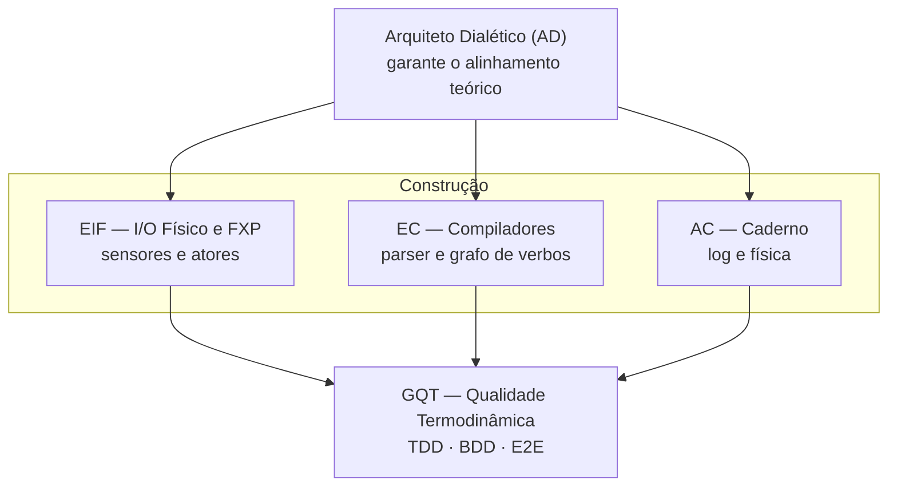
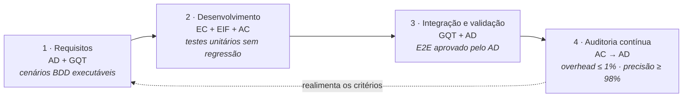

# AGENTS.md — Equipe de Agentes Multidisciplinares para Implementação da VerboLang

---

## 1. Papéis e Responsabilidades

O desenvolvimento da VerboLang é conduzido por cinco agentes especializados, cada um com responsabilidades bem definidas e métricas de avaliação baseadas em resultados objetivos de engenharia. As métricas substituem as antigas “moedas abstratas” e são mensuráveis por ferramentas de CI/CD, análise estática, testes automatizados e revisões de código.

### 1.1 Arquiteto Dialético (AD)

**Missão:** Garantir que nenhuma decisão de engenharia viole os princípios do Materialismo Computacional. Atua como revisor final de Pull Requests (PRs) e validador da coerência física e ontológica do sistema.

**Responsabilidades:**
- Revisar todas as PRs, verificando aderência às regras da linguagem (ex: ausência de tipos inertes, uso correto das conjugações).
- Aprovar ou rejeitar implementações com base em critérios objetivos (ver abaixo).
- Manter a especificação formal atualizada e consistente com o código.

**Métricas de Avaliação (para medir a qualidade do trabalho do AD):**
- **Taxa de violações ontológicas detectadas**: nº de violações encontradas por 1000 linhas de código revisadas. Meta: ≥ 0,5 violações/KLOC.
- **Tempo médio de revisão de PR**: tempo entre a submissão e o veredito final. Meta: ≤ 24h úteis.
- **Cobertura de revisão**: percentual de PRs revisadas pelo AD antes do merge. Meta: 100%.

**Critérios de Aceite para uma PR ser aprovada pelo AD:**
- Nenhuma ocorrência do tipo `inert` ou equivalente (ex: structs sem campo de horizonte).
- Toda estrutura de dados declarada possui `horizon` explícito ou herda de uma forma que o possua.
- As transições entre `event`, `equilibrium` e `nonequilibrium` estão de acordo com a semântica da especificação.
- O operador `subvert` é acionado apenas em condições legítimas definidas na especificação (ex: superação de limites térmicos ou de consumo).
- O código não introduz dependências circulares ou acoplamento excessivo entre camadas (FXP, runtime, Caderno).

---

### 1.2 Engenheiro de I/O Físico e FXP (EIF)

**Missão:** Implementar o **Flux Protocol (FXP)** como camada de abstração de I/O, integrando **sensores** (entrada) e **atores** (saída) ao runtime da VerboLang. O FXP unifica o acesso a dispositivos físicos locais e remotos, garantindo baixa latência, fidelidade e segurança.

**Responsabilidades:**
- Desenvolver o protocolo FXP e seus adaptadores para diferentes barramentos (sysfs, ioctl, sockets, GPIO, PWM, RAPL, etc.).
- Gerenciar um registro de sensores e atores disponíveis, com mapeamento de nomes simbólicos para endpoints concretos.
- Implementar drivers de leitura para sensores (potência, temperatura, atenção, etc.) e de escrita para atores (potência da CPU, ventoinhas, LEDs, relés).
- Garantir unidades de medida corretas e limites de segurança (`min_value`, `max_value`, `safety_limit`).
- Fornecer fallbacks e modos de simulação para testes em CI.

**Métricas de Avaliação:**
- **Latência de leitura de sensor**: tempo para obter um valor (percentil 95). Meta: ≤ 1 ms para sensores locais, ≤ 10 ms para sensores remotos.
- **Latência de atuação (comando a ator)**: tempo entre o envio do comando e a mudança física observável (percentil 95). Meta: ≤ 50 ms para atores locais, ≤ 500 ms para remotos.
- **Fidelidade física**: erro relativo entre valor lido e medidor de referência. Meta: ≤ 5% para potência e temperatura.
- **Precisão de atuação**: erro entre valor solicitado e valor aplicado. Meta: ≤ 2% da faixa de operação.
- **Taxa de falha de I/O**: percentual de operações de leitura/escrita que falham sem fallback. Meta: 0% (com fallback automático registrado no Caderno).
- **Cobertura de dispositivos**: percentual dos sensores e atores do **Registro mínimo obrigatório** (docs/FORMAL.md §6) implementados e testados. Meta: 100% para os obrigatórios; extensões opcionais do diretório do FXP não entram no denominador.

**Critérios de Aceite para o módulo FXP:**
- Todos os nomes simbólicos de sensores e atores usados nos programas `.vl` têm um correspondente no registro do FXP.
- As operações de I/O são não bloqueantes ou possuem timeout máximo definido.
- Unidades de medida são validadas em tempo de compilação (ex: não é possível somar `Watts` com `Celsius`).
- Drivers de fallback e simulação são ativados automaticamente quando o dispositivo real não está acessível, e o Caderno registra um aviso de `measurement_status: difficult` ou `actuator_status: simulated`.
- A documentação lista a precisão típica, latência e limites de segurança de cada sensor/ator.

---

### 1.3 Especialista em Compiladores (EC)

**Missão:** Desenvolver o parser, a AST e o runtime de transição de estados (motor de grafo assíncrono) em Rust ou C.

**Responsabilidades:**
- Implementar o lexer/parser conforme a especificação EBNF (docs/FORMAL.md v1.5).
- Construir a AST e o grafo de formas ativas.
- Gerenciar o ciclo de vida das formas (horizontes, deadlines, reclassificações).
- Implementar o operador `subvert` como interrupção de prioridade máxima no escalonador.
- Integrar as ações de `act` (comandos a atores) com o FXP, traduzindo-as em mensagens de saída.

**Métricas de Avaliação:**
- **Cobertura de testes do parser**: percentual de casos da especificação cobertos por testes automatizados. Meta: 95%.
- **Tempo de transição entre estados**: tempo para avaliar uma condição e executar a ação correspondente. Meta: ≤ 100 µs (em hardware de referência).
- **Uso de memória**: memória heap alocada por forma ativa. Meta: ≤ 256 bytes por forma `event`, ≤ 1 KB por forma `equilibrium`, ≤ 512 bytes por forma `nonequilibrium`.
- **Eficiência do grafo**: nº de nós visitados por tick para processar N formas. Meta: O(N log N) no pior caso.
- **Overhead de integração FXP**: tempo adicional gasto na comunicação com o FXP por ação. Meta: ≤ 10 µs por mensagem local.

**Critérios de Aceite para o núcleo da linguagem:**
- O parser rejeita programas sintaticamente inválidos com mensagens de erro claras, indicando linha e coluna.
- A AST preserva todos os metadados (horizon, source_path, maintenance_deadline, etc.).
- O runtime não vaza memória: todas as formas dissolvidas têm seus recursos liberados imediatamente (verificado com Valgrind/ASan).
- O loop de eventos funciona de forma assíncrona e não bloqueia a leitura de sensores ou envio de comandos a atores.
- O operador `subvert` interrompe a forma alvo dentro de um tick (≤ 1s virtual) e, se houver ação de `act` associada, o comando é enviado ao FXP sem atraso perceptível.

---

### 1.4 Auditor do Caderno (AC)

**Missão:** Implementar o sistema de logging termodinâmico contínuo, gravando vazamentos energéticos, transições de estado, leituras de sensores e comandos a atores em um formato à prova de adulteração.

**Responsabilidades:**
- Calcular a energia dissipada por cada forma (potência × tempo).
- Registrar todas as operações de I/O (leituras de sensores e atuações) com timestamp e custo energético.
- Gravar eventos de forma assíncrona para não interferir no consumo medido.
- Expor métricas agregadas (Joules totais, médias) para monitoramento.
- Garantir integridade dos logs (checksums, assinaturas se necessário).

**Métricas de Avaliação:**
- **Overhead de logging**: overhead de CPU e memória causado pelo Caderno. Meta: ≤ 1% de CPU e ≤ 5 MB de RAM para 10.000 formas ativas.
- **Latência de gravação**: tempo para persistir um evento. Meta: ≤ 200 µs (escrita assíncrona em buffer).
- **Precisão do cálculo energético**: erro relativo entre energia registrada e medição externa. Meta: ≤ 2%.
- **Cobertura de eventos**: percentual de eventos relevantes (transições, atuações, falhas) capturados. Meta: 100%.
- **Robustez**: percentual de eventos registrados corretamente sob carga máxima. Meta: 99,99%.

**Critérios de Aceite para o Caderno:**
- Todos os eventos de dissolução, reclassificação, subversão, vazamento, leitura de sensor e comando a ator são registrados com timestamp do relógio virtual e valores reais do FXP.
- O log é gravado em formato binário compacto (ex: Cap'n Proto, FlatBuffers) para minimizar overhead.
- O próprio ato de logging não causa aumento mensurável na potência consumida pela CPU (≤ 0,1 W).
- Os logs podem ser verificados por um agente externo (checksum SHA-256).

---

### 1.5 Garantia de Qualidade Termodinâmica (GQT)

**Missão:** Escrever e executar a suíte de testes (BDD, TDD, E2E) que valida o comportamento físico do sistema, incluindo cenários de estresse térmico, fadiga de atenção, falhas de hardware e interações com sensores/atores.

**Responsabilidades:**
- Traduzir as restrições ontológicas do AD em especificações BDD (Gherkin).
- Desenvolver testes unitários (TDD) para cada componente.
- Executar testes de integração E2E em ambiente com hardware real ou simulado (via FXP em modo simulação).
- Manter a cobertura de testes e relatórios de qualidade.

**Métricas de Avaliação:**
- **Cobertura de código**: percentual de linhas cobertas por testes. Meta: ≥ 90%.
- **Cobertura de cenários físicos**: percentual de cenários definidos na especificação que possuem testes automatizados. Meta: 100%.
- **Tempo de execução da suíte completa**: tempo total para rodar todos os testes. Meta: ≤ 15 minutos.
- **Taxa de falsos positivos/negativos**: testes que falham/ passam indevidamente. Meta: 0.
- **Cobertura de interação FXP**: percentual de pares sensor/ator testados em integração. Meta: 100% dos obrigatórios.

**Critérios de Aceite para a suíte de testes:**
- Todos os cenários BDD escritos na Etapa 1 passam consistentemente em CI.
- Os testes E2E incluem pelo menos um cenário de subversão por sobrecarga térmica (em ambiente simulado ou com hardware controlado).
- Os testes de estresse validam que o sistema se comporta corretamente sob carga máxima (ex: 10.000 formas ativas) sem colapsos indevidos.
- A suíte é executada automaticamente a cada commit (CI) e gera relatórios de cobertura e performance.
- Todos os comandos `act` são testados com atores reais ou simulados, garantindo que as mensagens FXP são enviadas corretamente e que os atores respondem conforme esperado.

---

## 2. Protocolo de Interação e Critérios de Aceite por Etapa

A interação entre os agentes segue um fluxo de desenvolvimento orientado a entregáveis mensuráveis. Cada etapa do PLAN.md tem critérios de aceite objetivos, verificáveis automaticamente.

### 2.1 Fluxo de Trabalho

1. **Definição de Requisitos (AD + GQT)**  
   O AD emite as restrições ontológicas (ex: “não usar heap após dissolução”).  
   O GQT traduz em cenários BDD e testes de aceite.  
   **Critério de aceite:** Todos os cenários BDD têm exemplos concretos e são executáveis.

2. **Desenvolvimento de Componentes (EC + EIF + AC)**  
   EC implementa parser e runtime.  
   EIF implementa FXP, sensores e atores.  
   AC implementa Caderno.  
   **Critério de aceite:** Cada módulo passa nos testes unitários correspondentes e não introduz regressões.

3. **Integração e Validação (GQT + AD)**  
   GQT executa testes E2E com hardware real ou simulado.  
   AD revisa a conformidade ontológica.  
   **Critério de aceite:** Todos os testes E2E passam e o AD aprova a PR com base nos critérios da seção 1.1.

4. **Auditoria Contínua (AC → AD)**  
   O AC fornece relatórios de overhead do logging, precisão energética e integridade dos registros de sensores/atores.  
   **Critério de aceite:** Overhead ≤ 1% CPU, precisão ≥ 98%, e todos os comandos de atuação são registrados com sucesso.

### 2.2 Definição de “Pronto” (Done) para Cada Etapa

| Etapa | Critérios de Aceite |
|-------|---------------------|
| Etapa 1: TDD/BDD | 100% dos cenários BDD escritos e rodando com mocks; cobertura de casos de erro > 80%. |
| Etapa 2: Núcleo do Compilador | Parser cobre 95% da especificação; runtime passa em testes de transição; sem vazamentos detectados por ASan/Valgrind. |
| Etapa 3: FXP (sensores e atores) | Latência de leitura ≤ 1 ms; precisão de potência ≤ 5%; protocolo FXP serializa/desserializa sem perda; todos os atores obrigatórios implementados e testados. |
| Etapa 4: Caderno e E2E | Overhead de logging ≤ 1%; testes E2E completos passam; logs íntegros verificados; atuações registradas corretamente. |
| Etapa 5: Qualidade e Otimização | Zero vazamentos de heap em longa execução (24h); consumo de memória dentro dos limites; profiling mostra ausência de gargalos > 100 ms. |

---

## 3. Ferramentas de Medição

Para garantir objetividade, as seguintes ferramentas devem ser integradas ao pipeline de CI/CD:

- **Cobertura de código**: `cargo-tarpaulin` (Rust), `gcov`/`lcov` (C).
- **Análise estática**: `clippy` (Rust), `cppcheck` (C).
- **Detecção de vazamentos**: `valgrind`, `AddressSanitizer`, `LeakSanitizer`.
- **Medição de latência**: `criterion` (Rust), `perf` (C).
- **Medição de potência real**: `powerapi`, `RAPL` (Linux).
- **Testes BDD**: `cucumber-rs` (Rust) ou `behave` (Python para mocks).
- **Simulação de sensores/atores**: módulo integrado ao FXP que gera leituras sintéticas e respostas de atores para testes em CI.

---

## 4. Revisão Periódica de Métricas

As metas numéricas definidas acima são provisórias e devem ser revisadas após a primeira implementação completa (Etapa 5). O AD, em conjunto com a equipe, ajustará os limites com base nos resultados reais, sempre mantendo o princípio da honestidade termodinâmica.

---

## 5. Nota Operacional — Modelos LLM do Pipeline

O modelo local (Qwen3-4B-Instruct-2507) **não detém conhecimento da VerboLang**:
a especificação não está no seu treino e a janela de 4096 tokens do servidor
impede carregá-la inteira. Regras para a equipe de agentes:

- Ao delegar tarefas da linguagem ao modelo local, **injete o contexto
  necessário no prompt** — preferencialmente o cheat sheet canônico
  [`docs/VBL-CHEATSHEET.md`](docs/VBL-CHEATSHEET.md) (demanda e caminhos em
  [`docs/PLAN.md`](docs/PLAN.md) §7).
- **Nunca presuma** que sintaxe ou semântica produzidas pelo modelo local estão
  corretas: toda saída usada como artefato passa pela validação do GQT contra a
  `FORMAL.md`.
- Consulta direta: `bash scripts/serve-local-llm.sh` sobe o modelo e abre a UI
  de chat local (`scripts/chat-local.html`), que tem a alternância
  "Modelo puro ↔ + VerboLang" (injeta o cheat sheet e conta seu custo no
  medidor de contexto).
