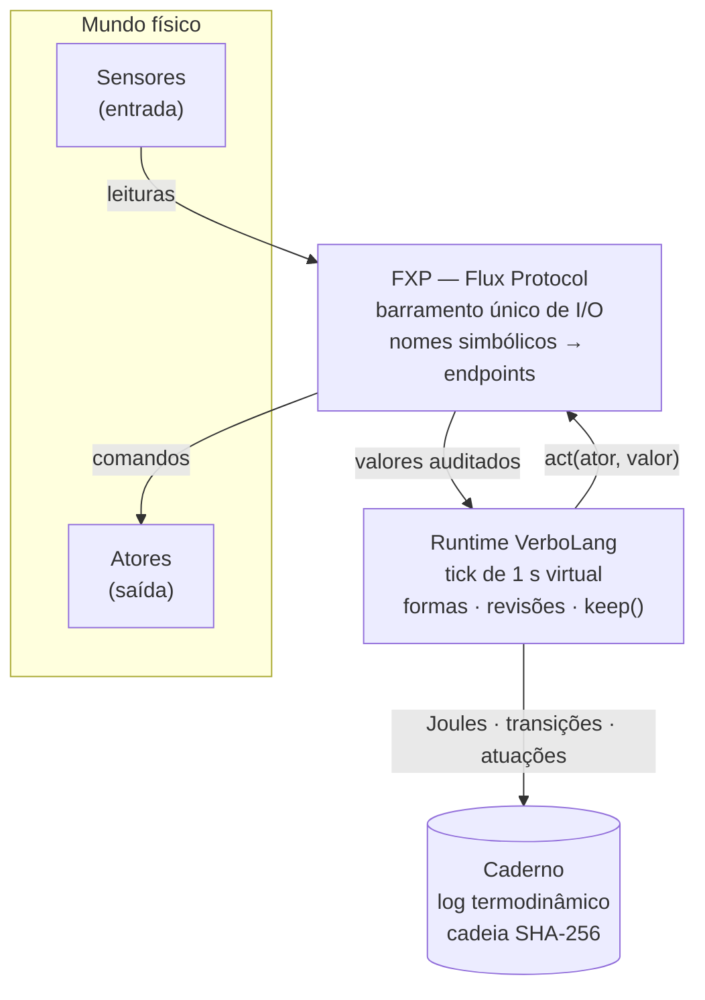
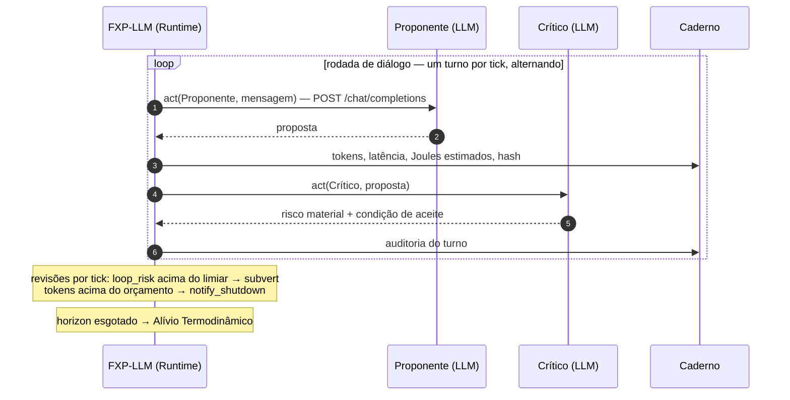

#

<p align="center"></p>

**Uma linguagem de programação onde nenhum dado é inerte.**

A VerboLang é uma linguagem de baixo nível alinhada ao **Materialismo Computacional**:
toda estrutura lógica é uma **forma** com suporte físico concreto, horizonte de validade,
custo energético e consequências termodinâmicas explícitas. A integridade do sistema não
se mede em selos de conformidade, mas em **Joules, Celsius e ciclos de CPU** — registrados
de forma auditável no **Caderno**.



## As três conjugações da matéria

| Conjugação | Significado | Ciclo de vida |
|---|---|---|
| `event` | Transiente — o acontecer puro | Horizonte curto, expira sem manutenção |
| `equilibrium` | Sustentado — estabilidade em suporte não volátil | Persiste, mas ocupa bytes (e não é eterno) |
| `nonequilibrium` | Laborativo — esforço contra a entropia | Exige `keep()` contínuo; colapsa sem manutenção |

## Exemplo

Subversão poética por sobrecarga térmica, com atuação física via FXP:

```verbolang
nonequilibrium SpeculativeTrading {
    value: "lucro_arbitragem_alta_frequencia",
    horizon: 7s,
    source_path: "cpu_temp",
    maintenance_deadline: 2s,
    exchange_mode: "extraction"
}

review SpeculativeTrading {
    when cpu_temp > 85°C -> subvert,
                             act(CpuPowerCap, 50)   // FXP limita a potência da CPU
}
```

Quando a CPU ultrapassa 85 °C, o runtime substitui o valor da forma pelo valor poético
canônico, dissolve-a no mesmo tick e envia o comando de limitação de potência ao ator
`CpuPowerCap`. Tudo — leitura, subversão, atuação, Joules dissipados — vai para o Caderno.

## Protótipo de referência

O blueprint em Python emula engine, FXP e Caderno, e serve como especificação
executável para a portabilidade futura para Rust ou C:

```bash
python3 prototype/verbolang-complete-blueprint.py
```

- Requisitos: Python **3.10+** (testado em 3.13), apenas biblioteca padrão.
- Saída: coreografia de 12 segundos virtuais no console + `caderno_log.jsonl`
  (artefato gerado, ignorado pelo git) com a cadeia SHA-256 verificável
  (ver `Caderno.verify_chain`).

### PoC: comunicação entre LLMs via VerboLang

O [`prototype/verbolang-llm-poc.py`](prototype/verbolang-llm-poc.py) coloca **dois agentes LLM**
(Proponente ↔ Crítico) para conversar sob o runtime VerboLang — sem alterar a
spec: cada agente é um **ator** no FXP (um `POST /chat/completions`), o estado
da conversa são **sensores** numéricos (turnos, tokens, latência, risco de
loop) e a conversa é uma forma `nonequilibrium` com regras de revisão:

- `when dialogo_loop_risk > 0.85 -> subvert` — repetição sem propósito (§4.5)
- `when dialogo_tokens > 2500 -> notify_shutdown` — orçamento estourado
- `horizon 8s` — Alívio Termodinâmico: a conversa se dissolve ao esgotar



```bash
bash scripts/serve-local-llm.sh        # terminal 1 — sobe o qwen3-4b local
python3 prototype/verbolang-llm-poc.py # terminal 2 — roda o diálogo auditado
```

Topologia "local primeiro": ambos os agentes usam o vLLM local. Para mover um
agente a outro nó (ex.: GLM cloud), defina `base_url`, `model` e `api_key_env`
em `AGENTES[nome]` — cada agente pode apontar para um endpoint diferente.
Atalho para "cloud dos dois lados": `VBL_AGENTE_URL` + `VBL_AGENTE_MODEL` +
`VBL_AGENTE_KEY_ENV` reconfigura todos os agentes de uma vez (assinantes do
Coding Plan devem usar a rota `https://api.z.ai/api/coding/paas/v4`; com
modelos *reasoning*, suba `VBL_MAX_TOKENS`, ex.: 512). Topologia mista
(validada): `VBL_CRITICO_URL` / `VBL_CRITICO_MODEL` / `VBL_CRITICO_KEY_ENV`
movem só o Crítico para o cloud, mantendo o Proponente no local.

Cada ramo da semântica tem um cenário de teste: `VBL_HORIZON` (fim por Alívio),
`VBL_TEMPERATURE` baixa + `VBL_LOOP_LIMITE` (`subvert` por repetição),
`VBL_SEM_KEEP=1` (colapso por manutenção expirada) e `VBL_TICKS` (duração).

O detector de repetição (`dialogo_loop_risk`) mede similaridade por
**embeddings**: se um nó expuser `/v1/embeddings` (OpenAI-compatível), basta
apontar `VBL_EMBED_URL`/`VBL_EMBED_MODEL` para ele — sem nó de embeddings, o
PoC cai automaticamente para *hashing* de n-gramas (100% stdlib, sem VRAM
extra). O método ativo fica registrado no Caderno. Nota: os 6 GB de VRAM não
comportam o chat e o modelo de embeddings simultaneamente — rode o nó de
embeddings com o chat desligado ou em outra máquina.

## Estrutura do repositório

| Arquivo | Papel |
|---|---|
| [`AGENTS.md`](AGENTS.md) | Equipe de agentes (AD, EIF, EC, AC, GQT), métricas e critérios de aceite — na raiz por convenção de harness |
| [`docs/MANIFESTO.md`](docs/MANIFESTO.md) | As seis leis do Materialismo Computacional |
| [`docs/FORMAL.md`](docs/FORMAL.md) | Especificação formal: tokens, EBNF, semântica operacional, registro FXP |
| [`docs/PLAN.md`](docs/PLAN.md) | Roadmap de execução em 5 etapas + análise de riscos |
| [`docs/FXP-SCHEMA-v1.md`](docs/FXP-SCHEMA-v1.md) | Schema v1 do Flux Protocol: frames, opcodes, flags, timeouts, config e rastreabilidade |
| [`docs/NOTEBOOK-FORMAT-v1.md`](docs/NOTEBOOK-FORMAT-v1.md) | Formato binário `.vcad` do Caderno de produção: frames, cadeia SHA-256, rodapé e verificação externa |
| [`core/`](core/) | Núcleo em Rust (Etapa 2+): `vbl-lang`, `vbl-runtime`, `vbl-fxp` (protocolo, drivers, barramento) e `vbl-cli` |
| [`docs/SETUP-LOCAL-LLM.md`](docs/SETUP-LOCAL-LLM.md) | Pipeline de LLMs: GLM-5.3/Flash (cloud) + Qwen3-4B-2507 (local) |
| [`prototype/verbolang-complete-blueprint.py`](prototype/verbolang-complete-blueprint.py) | Protótipo de referência (FXP, runtime, Caderno, bloco `main`) |
| [`prototype/verbolang-llm-poc.py`](prototype/verbolang-llm-poc.py) | PoC: comunicação inter-LLM (agentes LLM como atores/sensores no FXP) |
| [`tests/`](tests/) | Suíte da Etapa 1: BDD (behave), unitários (pytest), simulador FXP determinístico e fronteira mock |
| [`tests/vlcheck.py`](tests/vlcheck.py) | Validador de superfície `.vl` (mini-validador do PLAN §7) |
| [`.github/workflows/ci.yml`](.github/workflows/ci.yml) | CI (GitHub Actions): checagens estáticas + pytest + behave a cada push/PR |
| [`docs/STAGE-1-REPORT.md`](docs/STAGE-1-REPORT.md) | Relatório da Etapa 1: matriz de rastreabilidade, interpretações e divergências |
| [`docs/STAGE-2-REPORT.md`](docs/STAGE-2-REPORT.md) | Relatório da Etapa 2: parser, engine de tick, Caderno e CLI `vbl` |
| [`docs/STAGE-3-REPORT.md`](docs/STAGE-3-REPORT.md) | Relatório da Etapa 3: FXP real — schema v1, drivers, barramento, fila e transporte |
| [`docs/STAGE-4-REPORT.md`](docs/STAGE-4-REPORT.md) | Relatório da Etapa 4: Caderno de produção (assíncrono, `.vcad`), E2E e overhead medido |
| [`docs/STAGE-5-REPORT.md`](docs/STAGE-5-REPORT.md) | Relatório da Etapa 5: profiling, otimizações medidas, heap e execução longa |
| [`docs/STAGE-5-GOALS-REVIEW.md`](docs/STAGE-5-GOALS-REVIEW.md) | Revisão formal das metas provisórias (AGENTS §4) com números medidos |
| [`logs/stage4/`](logs/stage4/) | Logs reais do Caderno exportados das cargas E2E + relatórios de verificação externa |
| [`logs/stage5/`](logs/stage5/) | Baselines/medidas dos benches, soak de longa execução, ASan e logs do Caderno pós-otimização |
| [`docs/ADR-001-linguagem-nucleo.md`](docs/ADR-001-linguagem-nucleo.md) | Decisão Rust × C com orçamentos de memória/latência reancorados |
| [`docs/CHEATSHEET-PROMPTS.yaml`](docs/CHEATSHEET-PROMPTS.yaml) | Banco fixo de 20 prompts para validação do cheat sheet (PLAN §7) |
| [`docs/CHEATSHEET-VALIDATION.md`](docs/CHEATSHEET-VALIDATION.md) | Resultados versionados da validação do cheat sheet |
| [`scripts/validate_cheatsheet.py`](scripts/validate_cheatsheet.py) | Executa o banco de prompts contra o LLM local e avalia com o vlcheck |
| [`scripts/serve-local-llm.sh`](scripts/serve-local-llm.sh) | Sobe o modelo local Qwen3-4B-Instruct-2507-FP8 via vLLM (e abre a UI de consulta) |
| [`scripts/verbo-chat/chat.html`](scripts/verbo-chat/chat.html) | UI de consulta: chat single-file, streaming SSE, medidor de contexto, alternância puro ↔ +VerboLang |
| [`scripts/verbo-chat/verbolog.svg`](scripts/verbo-chat/verbolog.svg) | Marca do projeto (logo e favicon da UI de consulta) |
| [`docs/VBL-CHEATSHEET.md`](docs/VBL-CHEATSHEET.md) | VerboLang em uma página — cheat sheet canônico injetável como prompt de sistema |
| [`LICENSE`](LICENSE) | Licença GPL-3.0 (copyleft) |

> **Ordem de leitura sugerida:** [`docs/MANIFESTO.md`](docs/MANIFESTO.md) →
> [`docs/FORMAL.md`](docs/FORMAL.md) → [`docs/PLAN.md`](docs/PLAN.md) →
> [`AGENTS.md`](AGENTS.md).

## Máquina de referência dos experimentos

Todo número medido neste repositório — µs de latência, MB de heap, W e J do
Caderno, tok/s do LLM local, % de overhead — refere-se **a esta máquina**: onde
os testes são produzidos (arte) e as formas são criadas (razão). Fora dela, os
números são outros; as *lições* são as que viajam.

| Componente | Especificação (medida em 31/08/2026) |
|---|---|
| Host | Acer Nitro V 15 (ANV15-41) |
| CPU | AMD Ryzen 7 7735HS — Zen 3+, 8 núcleos / 16 threads |
| RAM | 30 GB DDR5 (+ 23 GB de swap) |
| GPU | RTX 4050 Mobile **6 GB GDDR6** (dGPU) · Radeon 680M (iGPU) |
| Armazenamento | NVMe 476 GB |
| SO | Ubuntu 26.04 — kernel `7.0.0-29-generic` |
| Toolchain | rustc 1.97.1 · Python 3.13.7 · criterion 0.5 |
| Sensores de energia | RAPL `intel-rapl:0` (package) · k10temp (`hwmon4`) |

Detalhes do pipeline de LLM local e as lições de VRAM em 6 GB:
[`docs/SETUP-LOCAL-LLM.md`](docs/SETUP-LOCAL-LLM.md). Metodologia dos benches
e reancoragem de metas: [`docs/STAGE-5-GOALS-REVIEW.md`](docs/STAGE-5-GOALS-REVIEW.md).

## Roadmap

Estado atual: **Etapas 1–5 concluídas** — suíte BDD/TDD, núcleo Rust (parser +
engine + Caderno + CLI `vbl`), FXP real (schema v1, drivers sysfs/RAPL/PWM/LED,
barramento real/simulado/híbrido, fila prioritária e transporte Unix/TCP), o
**Caderno de produção** (gravação assíncrona, formato binário `.vcad` com
cadeia SHA-256, verificação externa `vbl ledger-verify` e suíte E2E) e a
**revisão de qualidade/otimização** da Etapa 5 (encoder direto do Caderno,
hash incremental, auditor de heap, soak de longa execução e revisão formal
das metas) ([relatório da Etapa 5](docs/STAGE-5-REPORT.md)).

1. **Etapa 1** ✅ — Suíte BDD/TDD/E2E com mocks e simulador FXP
2. **Etapa 2** ✅ — Núcleo da linguagem em **Rust**: lexer, parser, AST e motor de tick assíncrono ([ADR-001](docs/ADR-001-linguagem-nucleo.md))
3. **Etapa 3** ✅ — FXP real: schema v1, registro de dispositivos, drivers, barramento multi-modo e transporte local×remoto ([relatório](docs/STAGE-3-REPORT.md))
4. **Etapa 4** ✅ — Caderno de produção (gravação assíncrona, `.vcad`, `ledger-verify`) e validação end-to-end ([relatório](docs/STAGE-4-REPORT.md))
5. **Etapa 5** ✅ — Qualidade, profiling termodinâmico e otimização ([relatório](docs/STAGE-5-REPORT.md) · [revisão de metas](docs/STAGE-5-GOALS-REVIEW.md))

Para rodar a suíte: `make setup && make test` (Python) e `make rust-check` +
`make rust-e2e` (núcleo Rust, Etapas 2–4). Gates da Etapa 5:
`make rust-memoria` (orçamentos de heap) e `make rust-soak` (execução longa).
Detalhes e critérios de aceite por etapa em [`docs/PLAN.md`](docs/PLAN.md) e [`AGENTS.md`](AGENTS.md).

## Desenvolvimento assistido por LLMs

O projeto usa um pipeline de **dois modelos**: o orquestrador **GLM-5.3/Flash**
(cloud, revisão de ontologia e arquitetura) e o **Qwen3-4B-Instruct-2507**
(local, via vLLM — trabalho bulk offline, dados de sensores não saem da máquina).
Configuração completa em [`docs/SETUP-LOCAL-LLM.md`](docs/SETUP-LOCAL-LLM.md).

> **Atenção:** o modelo local **não conhece a VerboLang** — a especificação não
> está no seu treino e a janela de 4096 tokens impede carregá-la inteira.
> Tarefas da linguagem exigem injetar contexto no prompt: use o modo
> **"+ VerboLang"** da UI de consulta (injeta o
> [`docs/VBL-CHEATSHEET.md`](docs/VBL-CHEATSHEET.md)) ou o cheat sheet no seu
> próprio prompt. Demanda e caminhos (cheat sheet, RAG, fine-tune) em
> [`docs/PLAN.md` §7](docs/PLAN.md).

Para consulta direta ao modelo local, `bash scripts/serve-local-llm.sh` abre
automaticamente a **UI de chat** ([`scripts/verbo-chat/chat.html`](scripts/verbo-chat/chat.html))
quando o modelo termina de carregar — streaming, medidor de contexto e a
alternância puro ↔ +VerboLang.

## Licença

Distribuído sob a [GNU GPL-3.0](LICENSE) — Copyright (C) 2026 Silvano Neto.
Copyleft: cópias e derivados devem permanecer sob a mesma licença, com o
código-fonte disponível. No vocabulário do projeto: **o comum exige `keep()`** —
a abertura não é dada, é sustentada.

> Nota: a GPL-3.0 cobre o código e a documentação deste repositório. Os modelos
> de LLM citados no pipeline seguem as próprias licenças (Qwen3-4B: Apache-2.0;
> GLM: MIT) e apenas são executados localmente via API — nada de seus pesos ou
> códigos é redistribuído ou incorporado aqui.

> *Pois o Ser é movimento dialético, contínuo e termodinâmico do Real. E o nosso código,
> enfim, aprendeu a dançar com a matéria — lendo seus sinais e respondendo com atos.*
