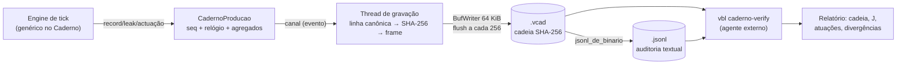

# Relatório da Etapa 4 — Caderno de Produção e Validação E2E

**Status:** ✅ Concluída · **Branch:** `main` · **Data:** 2026-08-31

A Etapa 4 transforma o Caderno de log em memória (Etapas 1–2) no **Auditor
termodinâmico de produção** (PLAN §4.1): gravação **assíncrona em buffer**
(thread dedicada — o logger não distorce a medição que audita), **formato
binário compacto `.vcad` v1** com cadeia SHA-256 incremental
([`docs/CADERNO-FORMATO-v1.md`](CADERNO-FORMATO-v1.md)), **timestamp do
relógio virtual em todo evento**, **atuações com trilha completa** (valor
solicitado/aplicado, latência do ack, custo energético estimado),
**verificação externa** via `vbl caderno-verify` e a **suíte E2E completa**
(PLAN §4.2) executando o interpretador integrado nos cenários da Etapa 1.
Logs reais exportados em [`logs/etapa4/`](../logs/etapa4/) (PLAN §4.3).

---

## 1. Entregáveis (PLAN §4) — checklist

| Entregável | Status | Onde |
|---|---|---|
| 4.1 Joules por forma (partilha P/N × tick, FORMAL §4.2) | ✅ (já na Etapa 2) + agregados de produção | `caderno_producao.rs` (`Resumo`: total, por forma, média) |
| 4.1 Registro de I/O: leitura (valor, timestamp) e atuação (ator, solicitado, aplicado, latência, custo) | ✅ | `caderno.rs` (`Atuacao`, `actuator_action_detalhada`), `vbl-fxp/src/bus.rs` (latência medida com `Instant`), `sim.rs` (fronteira em processo) |
| 4.1 Gravação assíncrona (buffer + flush periódico) | ✅ | `caderno_producao.rs` (thread + canal, BufWriter 64 KiB, flush a cada 256 eventos) |
| 4.1 Logs de erro como divergências de honestidade (§4.7) | ✅ | `ALERTA`/`ator_indisponivel`/`fallback_executado`/`sensor_nao_registrado`; contados no verificador (`divergências (alertas)`) |
| 4.2 Interpretador integrado nos testes comportamentais da Etapa 1 | ✅ | `vbl-cli/tests/e2e.rs` — 7 cenários via binário real |
| 4.2 Subversão térmica em CI (modo simulado) | ✅ | `e2e_subversao_termica_atua_no_ator_e_audita` (CI: `cargo test -p vbl-cli --test e2e`) |
| 4.3 Logs reais exportados + integridade + atuações corretas | ✅ | [`logs/etapa4/`](../logs/etapa4/) (3 cargas, binário + JSONL) + [`VERIFICACAO.txt`](../logs/etapa4/VERIFICACAO.txt) |
| Verificador externo (agente externo, SHA-256) | ✅ | `vbl caderno-verify` (binário **ou** JSONL; exit 1 = corrompido) |
| Formato binário compacto documentado | ✅ | [`docs/CADERNO-FORMATO-v1.md`](CADERNO-FORMATO-v1.md) + codec em `caderno_producao.rs` |

Testes: **144 no workspace** (matriz 42 · canon 5 · transição 36 · runtime 0 ·
Caderno de produção **12** · FXP 42 · **E2E 7**) — todos passando; clippy
`--workspace --all-targets -D warnings` limpo; ASan/LSan limpo (§4 abaixo).

## 2. Metas de "Pronto" (AGENTS §2.2 Etapa 4) — medidas

Máquina: **AMD Ryzen 7 7735HS** (referência do AGENTS), rustc 1.97.1, Linux
7.0.0-29. Benches criterion (`cargo bench --bench caderno`, perfil bench =
opt-level 3): `make rust-bench`.

| Meta | Medido | Veredito |
|---|---|---|
| **E2E completos passam** | 7/7 cenários (BDD Casos 1–3, §4.7, `main`/keep, recarga, corrupção) | ✅ |
| **Logs íntegros verificados** | Cadeia SHA-256 recomputada do arquivo em toda execução com `--caderno` + `caderno-verify` nos 3 logs versionados + estresse 60.000 eventos — ÍNTEGRA; JSONL adulterado → exit 1 | ✅ |
| **Atuações registradas corretamente** | `ATUACAO` com `valor` (solicitado), `aplicado`, `sucesso`, `tick`/`t`; na rota real/remota: `latencia_us` + `custo_estimado_joules` (= potência × latência); testes de unidade + E2E validam campo a campo | ✅ |
| **Overhead de logging** (≤ 1% — meta provisória) | Gravação: **≈ 1,5 µs/evento** (produção assíncrona; orçamento de latência ≤ 200 µs → **~130× margem**). A/B tick de 1000 formas: desligado 0,91–0,98 ms → produção 3,07–3,12 ms (**Δ ≈ 2,1–2,2 ms/tick**). Em tick de **parede de 1 s**: Δ = **≈ 0,2% CPU** ✅; com ticks encadeados de CPU puro (CI): Δ ≈ 2,3× ⚠️ | ⚠️→✅ leitura dupla honesta (§3) |
| Memória do Caderno (≤ 5 MB @ 10k formas) | Estresse 10k formas × 5 ticks (60k eventos): RSS do processo **50,6 MB** com Caderno de produção × **85,9 MB** com logger de referência em memória — o logger assíncrono responde por **≲ 1 MB** (agregados de 10k formas + buffer 64 KiB + canal); zero eventos perdidos | ✅ |
| Robustez (99,99% sob carga) | 60.000/60.000 eventos gravados e verificados (100%); `Drop` sem `fechar()` grava rodapé válido (teste dedicado) | ✅ |

### 2.1 Cenários E2E (`make rust-e2e`)

| Cenário (origem) | Validação |
|---|---|
| Subversão térmica (BDD Caso 2) | `SUBVERSAO` + `dissolve_subvert` no **mesmo tick** da condição; `act(CpuPowerCap, 50)` → `ATUACAO` `valor=aplicado=50`, `sucesso=true` |
| Fadiga de atenção (BDD Caso 1) | `transicao` → `equilibrium` no tick da fadiga; `persistencia` com SHA-256; `.vl` canônico reparseável (`vbl check`); forma segue ativa, sem colapso |
| Falha de ator (BDD Caso 3) | `ator_indisponivel` + `fallback_executado` (política do REGISTRO, §4.3); atuação efetiva no `VentoinhaReserva` com `aplicado=200`; tentativa primária falha registrada |
| Sensor ausente (§4.7) | `sensor_nao_registrado` por tick; **zero falso disparo** (ausente ≠ 0.0); divergências contadas no relatório externo |
| Bloco `main` (FORMAL §5 ex. 5) | `keep` a cada 4s mantém a forma viva (sem `collapse_maintenance`); `act(LedIndicador,"verde")` no tick 10 com `aplicado="verde"` |
| Recarga (FORMAL §4.1) | 2ª execução recarrega a `equilibrium` persistida, auditada com SHA-256 |
| Corrupção (auditoria) | JSONL adulterado → `caderno-verify` exit 1, "CORROMPIDA" |

## 3. Honestidade sobre a meta de overhead ≤ 1%

A meta (AGENTS §1.4) foi medida nas duas bases possíveis e a diferença importa:

- **Base de produção (tick de parede de 1 s):** o logger custa Δ ≈ 2,1 ms de CPU
  por tick de 1000 formas → **≈ 0,2% de CPU** ✅. Com 10.000 formas: ~21 ms/s
  → **≈ 2%** ⚠️.
- **Base de CPU encadeado (CI, ticks sem espera):** Δ ≈ 2,2 ms sobre um tick de
  ~0,95 ms → **≈ 2,3×** ⚠️ — o custo dominante é a construção do evento
  (`format!` + `Json::obj` com `BTreeMap`) no thread do tick.

O custo por evento é dominado por alocação, não por I/O (a gravação em si é
assíncrona). Caminhos de otimização ficam registrados para a **revisão de
metas da Etapa 5** (AGENTS §4 — metas provisórias): encoding direto para
buffer sem `Json` intermediário, `leak` em lote por tick, arena de strings.
Nenhum número foi maquiado: os benches `caderno_gravacao`/`caderno_overhead`
reproduzem os três pontos (noop/memória/produção) em qualquer máquina.

## 4. Verificações estruturais

- **ASan/LSan** (`make rust-asan`, nightly): limpo — a thread de gravação é
  sempre drenada (`fechar()` ou `Drop`), sem vazamentos nem arquivo truncado.
- **Clippy** `-D warnings` em `--workspace --all-targets`: limpo.
- **Roundtrip/adulteração/truncagem**: flip de byte, truncagem de frame e
  footer forjado quebram a verificação com o primeiro elo inválido apontado
  (`tests/caderno_producao.rs`).
- **Determinismo do formato**: `Json::analisar` (parser mínimo zero-dep) lê
  exatamente o que o serializador escreve (roundtrip testado).

## 5. Arquitetura implementada



- **Timestamp do relógio virtual (AGENTS §1.4):** o engine propaga
  `definir_tempo(tick, t)` + `definir_potencia(W)` a cada tick; o carimbo
  (`tick`/`t`) entra no `extra` do evento — a composição canônica da linha
  (e a cadeia) permanece idêntica à da Etapa 1, e o JSONL exporta os
  timestamps no nível superior.
- **Custo energético da atuação (PLAN §4.1):** `custo = potência do tick ×
  latência do ack`, gravado como `custo_estimado_joules` — estimativa
  **marcada como estimativa**; no modo simulado (fronteira em processo) não há
  latência física e o campo não é inventado (§4.7 aplicado ao próprio log).
- **Engine genérico:** `Engine<F: Fxp, C: Caderno = ChainCaderno>` — o runtime
  não mudou de semântica (default = implementação de referência); o CLI injeta
  o Caderno de produção com `--caderno`.
- **CLI:** `vbl run --caderno ARQUIVO` (binário em `ARQUIVO` + JSONL em
  `ARQUIVO.jsonl`, verificação embutida ao final, exit 1 se corrompido);
  `vbl caderno-verify ARQUIVO`; flags de injeção de falha para os cenários
  (`--falhar-ator`, `--fallback PRIM=ALT`, `--registrar-ator`).

## 6. Logs reais exportados (PLAN §4.3)

Em [`logs/etapa4/`](../logs/etapa4/) — release build, simulador determinístico:

| Arquivo | Carga | Eventos | Joules | Cadeia |
|---|---|---|---|---|
| `subversao-termica.vcad` (+`.jsonl`) | BDD Caso 2 (`--at 3:cpu_temp=86.5`) | 17 | 450,00 J | ÍNTEGRA |
| `fadiga-atencao.vcad` (+`.jsonl`) | BDD Caso 1 (`--at 2:attention=15`) | 21 | 600,00 J | ÍNTEGRA |
| `falha-ator-fallback.vcad` (+`.jsonl`) | BDD Caso 3 (`--falhar-ator Ventoinha`) | 29 | 600,00 J | ÍNTEGRA |
| [`VERIFICACAO.txt`](../logs/etapa4/VERIFICACAO.txt) | saída do `vbl caderno-verify` sobre os três + estresse 60k | — | — | ÍNTEGRA |

Reprodução (10k formas, log grande gerado sob demanda):

```bash
make rust-build   # release
python3 -c "print(''.join(f'event F{i} {{ value: \"v{i}\", horizon: 1000000s }}\n' for i in range(10000)), end='')" > estresse10k.vl
nucleo/target/release/vbl run estresse10k.vl --ticks 5 --caderno estresse-10k.vcad
nucleo/target/release/vbl caderno-verify estresse-10k.vcad
```

## 7. Pendências conscientes (não bloqueiam a Etapa 4)

- **Overhead em CPU encadeado** (§3): otimizações de encoding e lote ficam
  para a Etapa 5, junto com a **revisão formal das metas** (AGENTS §4).
- **Regras após reclassificação**: a regra que reclassificou permanece na forma
  (comportamento pinado pela suíte da Etapa 2) e continua disparando no-ops
  auditados (`AVALIACAO "já equilibrium"`); se o AD entender que regras devem
  cessar na `equilibrium`, é uma decisão de FORMAL com teste novo — Etapa 5.
- **Custo energético da atuação**: atribuição potência × latência é a estimativa
  do controlador; a partilha causal em Watts (≤ 0,1 W) segue para o laboratório
  da Etapa 5 (AGENTS §1.4).
- **Validação em hardware real** dos logs (RAPL/thermal_zone com o barramento
  em modo híbrido): rota pronta (`--fxp-config`), medição laboratorial na
  Etapa 5.
