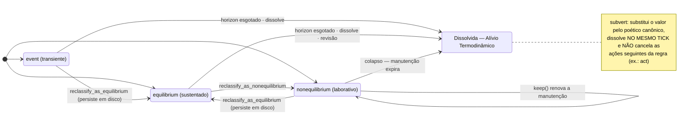
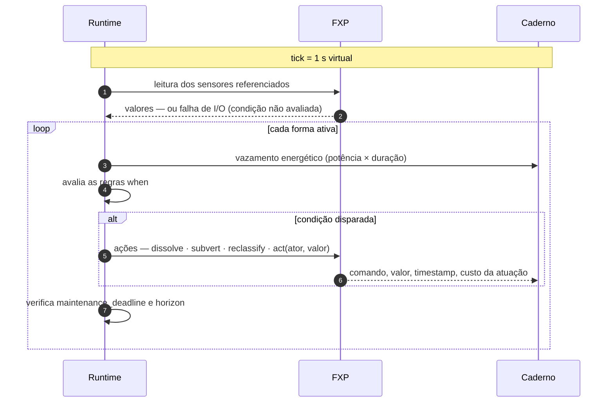

# FORMAL.md — Especificação Formal da VerboLang

---

## 1. Introdução

A **VerboLang** é uma linguagem de programação de baixo nível alinhada ao **Materialismo Computacional**. Ela não trata dados como entidades inertes, mas como **formas** em constante movimento, sujeitas às leis termodinâmicas. A integridade do sistema é medida em Joules, graus Celsius e ciclos de CPU, registrados no **Caderno**.

A interação com o mundo físico é feita através do **FXP (Flux Protocol)**, um barramento de I/O que unifica **sensores** (entrada) e **atores** (saída). Os sensores capturam o estado do ambiente; os atores projetam decisões de volta ao mundo material, agindo sobre ele. A VerboLang não distingue entre dispositivos locais ou remotos; ela apenas declara formas e condições de revisão. Quando uma condição exige uma ação de atuação, o runtime envia uma mensagem FXP com o comando correspondente ao ator nomeado.

---

## 2. Unidades Léxicas (Tokens)

- **Identificadores**: `[a-zA-Z_][a-zA-Z0-9_]*`
- **Números inteiros**: `[0-9]+`
- **Números decimais**: `[0-9]+ '.' [0-9]+`
- **Strings**: aspas duplas `"..."`, com escapes `\"`, `\\`, `\n`, `\t`.
- Tamanho máximo de um literal string: 256 bytes.
- **Operadores**: `:`, `,`, `;`, `{`, `}`, `(`, `)`, `->`, `<`, `>`, `<=`, `>=`, `==`, `!=`, `%`.
- **Palavras-chave**:
  - Conjugações: `event`, `equilibrium`, `nonequilibrium`
  - Declarações: `review`, `main`
  - Controle: `when`, `keep`, `every`
  - Ações: `dissolve`, `subvert`, `reclassify_as_equilibrium`, `reclassify_as_nonequilibrium`, `notify_shutdown`, `act`
  - Atributos de formas: `value`, `horizon`, `source_path`, `maintenance_deadline`, `exchange_mode`, `cost_bytes`, `currency`, `classification`
  - Unidades de tempo: `s`, `ms`, `us`, `ns`
  - Unidades físicas: `W`, `°C`, `%`
- **Comentários**: `//` linha, `/* ... */` bloco.

> **Nota:** Não há declaração explícita de atores. Atores são referenciados por um nome simbólico (ex: `CpuPowerCap`, `Fan`) que o FXP conhece e gerencia.

---

## 3. Estrutura de um Programa `.vl`

Um programa VerboLang é composto por **declarações de formas** e **declarações de revisão**. Opcionalmente, um bloco `main` permite controle imperativo.

**Gramática geral (EBNF):**

```ebnf
program              = { form_declaration | review_declaration } [ main_block ] ;

form_declaration     = conjugation_kw identifier '{' form_body '}' ;
conjugation_kw       = 'event' | 'equilibrium' | 'nonequilibrium' ;

form_body            = 'value' ':' expression ',' 'horizon' ':' duration
                       { ',' optional_attribute } ;
optional_attribute   = 'source_path' ':' string          (* caminho FXP de leitura de sensor *)
                     | 'maintenance_deadline' ':' duration        (* apenas nonequilibrium — obrigatório nela *)
                     | 'exchange_mode' ':' string                (* apenas nonequilibrium *)
                     | 'cost_bytes' ':' integer                  (* apenas equilibrium *)
                     | 'currency' ':' string                     (* opcional *)
                     | 'classification' ':' string               (* opcional *)
                     ;

review_declaration   = 'review' identifier '{' review_rule { ',' review_rule } '}' ;
review_rule          = 'when' sensor_ref comparison_op threshold '->' action_list ;
sensor_ref           = identifier | string ;   (* nome simbólico do sensor no FXP *)
comparison_op        = '<' | '>' | '<=' | '>=' | '==' | '!=' ;
threshold            = number | percentage | physical_quantity ;
action_list          = action { ',' action } ;
action               = 'dissolve'
                     | 'subvert'
                     | 'reclassify_as_equilibrium'
                     | 'reclassify_as_nonequilibrium'
                     | 'notify_shutdown'
                     | 'act' '(' actor_name ',' expression ')' ;  (* envia comando via FXP para um ator *)

main_block           = 'main' '{' statement { ',' statement } '}' ;
statement            = 'keep' '(' identifier ')'                    (* renovação manual *)
                     | 'act' '(' actor_name ',' expression ')'     (* atuação direta *)
                     | 'every' duration '{' statement { ',' statement } '}' ;

(* Produções auxiliares — completam a gramática nesta versão *)
expression           = string | number | identifier ;
duration             = number time_unit ;
time_unit            = 's' | 'ms' | 'us' | 'ns' ;
number               = integer | decimal ;
percentage           = number '%' ;
physical_quantity    = number physical_unit ;
physical_unit        = 'W' | '°C' ;
```

### Notas sobre a gramática

- `source_path` é um nome **exclusivamente simbólico** (ex: `"cpu_temp"`, `"solar_panel"`) que o FXP mapeia para um sensor físico ou virtual. Caminhos de sistema operacional (ex: `/sys/...`, `/dev/...`) **não** são `source_path` válidos: o mapeamento para endpoints concretos é responsabilidade do registro do FXP (cf. §6).
- `actor_name` é um identificador simbólico (ex: `CpuPowerCap`, `Fan`) que o FXP reconhece como ator.
- Não há declaração explícita de atores; a configuração fica a cargo do FXP, que mantém um diretório de dispositivos e serviços disponíveis.
- A ação `act` envia um comando FXP com o valor especificado para o ator nomeado.
- O bloco `main` pode conter `act` diretamente, permitindo atuações periódicas.
- `expression` aceita string, número ou identificador. O campo `value` não é interpretado pelo runtime: é o conteúdo lógico da forma, opaco ao motor de transições.
- `duration` aceita decimais (ex: `2.5s`) e é convertida para segundos (ponto flutuante de 64 bits). Durações sub-secondo são válidas, mas avaliadas na granularidade do tick (1 s virtual por padrão).
- `threshold` com unidade física (`85°C`, `150W`) ou porcentagem (`30%`) é convertido para valor numérico puro antes da comparação; a unidade é validada contra a grandeza declarada do sensor no registro do FXP.
- `currency` (opcional): unidade física em que o consumo da forma é contabilizado no Caderno. Valores canônicos: `"CpuCycles"` (padrão de `event`), `"DiskBytes"` (padrão de `equilibrium`), `"PowerWatts"` (padrão de `nonequilibrium`). Se ausente, herda o padrão da conjugação. Afeta apenas a contabilidade termodinâmica, nunca a lógica de revisão.
- `classification` (opcional): anotação de metadado para auditoria externa (ex: `"Transiente"`, `"TrabalhoAtivo"`); sem efeito semântico no runtime.
- `exchange_mode` (opcional, apenas `nonequilibrium`): valores canônicos `"cooperation"` e `"extraction"`; anotação de auditoria registrada no Caderno — o efeito semântico pleno será definido na Etapa 2 (item registrado no PLAN.md §2.2).
- `value` e `horizon` são **obrigatórios** para toda conjugação (Lei 1 do MANIFESTO; critério do AD em AGENTS.md §1.1): a gramática os exige como primeiros atributos e o parser deve rejeitar formas que os omitam.
- `maintenance_deadline` é **obrigatório** em `nonequilibrium`: sem ele, a forma laborativa jamais colapsaria. `reclassify_as_nonequilibrium` sobre uma forma sem deadline declarado é **erro de runtime registrado no Caderno** — a forma permanece como estava.
- `review` para forma inexistente, ou segunda `review` para a mesma forma, são **erros de compilação**: regras não são mescladas.

---

## 4. Semântica Operacional

### 4.1 Formas e Conjugações

- **`event`**: transitória, horizonte curto, sem manutenção.
- **`equilibrium`**: persistente, sem manutenção, com custo em bytes.
- **`nonequilibrium`**: requer manutenção contínua; colapsa se exceder `maintenance_deadline`.

**Manutenção.** O prazo de uma forma `nonequilibrium` é renovado por: (i) `keep(forma)` explícito em `main`; ou (ii) manutenção **implícita** do runtime, a cada tick, enquanto a forma tiver ao menos uma regra de revisão ativa (regra própria que ainda não tenha dissolvido/subvertido a forma). Sem (i) e sem (ii), a forma colapsa no primeiro vencimento do `maintenance_deadline` — trabalho sem vigilância colapsa.



**Matriz de transições legais:** `event→equilibrium`, `equilibrium→nonequilibrium`, `nonequilibrium→equilibrium` e `nonequilibrium→nonequilibrium` (keep). Não há retorno a `event`: `reclassify_as_nonequilibrium` sobre uma forma `event` é erro de runtime registrado no Caderno (a forma permanece `event`). Ação de revisão sobre forma já dissolvida no mesmo tick é ignorada, com registro `review_after_dissolution`.

**Regras de revisão após reclassificação (decisão do AD, Etapa 5):** as regras de revisão **sobrevivem às transições** e permanecem **ativas na `equilibrium`** — o diagrama acima lista `revisão` como caminho de EQ → DIS, e o tick (§4.2) avalia as condições de revisão de cada forma ativa. O que cessa na `equilibrium` é apenas a **manutenção implícita** (§4.1). Disparo cuja ação não altera o estado (ex.: `reclassify_as_equilibrium` sobre forma já `equilibrium`) é **no-op auditado** no Caderno (nível `AVALIACAO`), sem nova transição e sem dissolução.

**`horizon` é absoluto:** contado desde a criação; reclassificações não o renovam (Lei 1 — toda existência é finita).

**Persistência:** toda forma `equilibrium` vive em suporte não volátil. Ao reclassificar para `equilibrium` — de qualquer origem — a forma é gravada como `.vl` canônico reparseável no diretório de persistência do runtime, e o Caderno registra o evento com caminho e SHA-256 do conteúdo. `cost_bytes` ausente passa a valer o tamanho real gravado. Na inicialização, o runtime recarrega as `equilibrium` persistidas cujo `horizon` não venceu.

### 4.2 Ciclo de Vida (tick)

A cada tick (1 segundo virtual por padrão):

1. O runtime consulta o FXP para obter as leituras atuais dos sensores referenciados pelas formas.
2. Para cada forma ativa:
   - Calcula vazamento energético (potência × duração) e registra no Caderno.
   - Avalia as condições de revisão, utilizando os valores de sensores fornecidos pelo FXP.
   - Verifica prazos de manutenção e horizonte.
   - Executa ações correspondentes.
3. Ações de `act` são traduzidas em mensagens FXP de saída e enviadas ao ator alvo.

**Ordem e precedência no tick:** as regras de revisão são avaliadas na **ordem declarada**, antes da verificação de prazos. Se uma ação dissolve ou subverte a forma, as regras seguintes da mesma `review` não são avaliadas naquele tick (`review_short_circuit`), sem revogar atuações já despachadas; a expiração de `horizon`/`maintenance_deadline` só age se a forma seguir ativa ao final do passo.

**Atribuição de vazamento:** a potência lida no tick (`cpu_power`, global) é repartida **igualmente** entre as formas ativas naquele tick; cada forma registra `P/N × duração_do_tick`, convertido para sua `currency`. `source_path` de grandeza potência serve às regras de revisão e **não** altera a partilha (evita dupla contagem). Metering direto por forma é extensão futura.

**Relógio virtual:** o tick é dirigido por um relógio virtual injetável — 1 tick ≈ 1 s de parede por padrão em produção; em teste, o simulador avança o relógio instantaneamente (determinismo). Métricas de latência de parede são medidas em benchmarks dedicados, não na suíte de ticks. O escalonamento usa **fila de prazos** (min-heap por `horizon`/`maintenance_deadline`): O(log N) por mutação e varredura O(N + vencidos) por tick.



### 4.3 Condições de Revisão com Ação para Atores

A ação `act(ator, valor)`:

- O runtime verifica se o ator está registrado no FXP e disponível.
- Verifica se o valor está dentro dos limites definidos pelo FXP (mínimo, máximo, limite de segurança) — limites **inclusivos**: valor igual ao limite é aceito.
- Comando fora dos limites é **rejeitado sem envio**; o Caderno registra `actor_rejected_value` (valor solicitado, limite violado) e a forma não é dissolvida pela rejeição.
- Envia comando assíncrono via FXP.
- Registra no Caderno o comando, valor, timestamp e custo energético da atuação.
- Se o ator falhar ou não responder (heartbeat do FXP), a **política de fallback é do registro do FXP** (primary → alternativos); tentativa, falha e fallback executado aparecem como eventos no Caderno. O runtime não implementa fallback próprio — pode reagir ao resultado (ex: outra ação ou dissolver a forma).

### 4.4 FXP (Flux Protocol)

O FXP é a camada de I/O que abstrai a comunicação com sensores e atores. Ele pode ser implementado sobre sockets, barramentos, sysfs, etc. A VerboLang não se preocupa com detalhes de baixo nível; apenas usa nomes simbólicos.

### 4.5 Semântica de `subvert`

A ação `subvert` é uma **interrupção de prioridade máxima** no escalonador:

1. Substitui o valor lógico da forma pela expressão de correção (por padrão, o valor poético canônico `"poesia_gerada_pelo_calor_do_silicio_e_resfriamento_da_mente"`) e registra o evento no Caderno.
2. **Encerra o ciclo da forma**: a forma é dissolvida dentro do mesmo tick em que a condição dispara (≤ 1 tick virtual), com liberação imediata de recursos. Encerra também a avaliação das **regras seguintes da mesma `review`** (`review_short_circuit`), sem revogar atuações já despachadas.
3. **Não cancela as demais ações da mesma regra**: a `action_list` continua sendo executada na ordem declarada após o `subvert` — em particular, qualquer `act` associado é enviado ao FXP (ex: `subvert, act(CpuPowerCap, 50)`).
4. Condições legítimas de acionamento: superação de limites termodinâmicos (térmicos, de consumo) ou ciclos insustentáveis (repetição sem propósito), cf. MANIFESTO §5. O AD rejeita PRs que acionem `subvert` fora dessas condições.

### 4.6 Semântica de `notify_shutdown`

`notify_shutdown` sinaliza ao runtime/FXP o desligamento das cargas secundárias associadas à forma. Não dissolve a forma por si só e não interrompe a execução das ações seguintes da mesma regra. Não há sintaxe para associar cargas a uma forma: as associações são configuração do FXP (fora da linguagem); sem associação registrada, `notify_shutdown` é um evento auditado sem efeito adicional.

### 4.7 Falha de sensor

Se um sensor referenciado (`source_path` ou sensor de condição de revisão) não estiver registrado no FXP, trata-se de **falha de I/O**: o Caderno registra um alerta e a condição **não é avaliada** naquele tick. Um sensor ausente nunca é tratado como leitura `0.0` — zero é uma leitura física válida e dispararia falsas condições de revisão. Sensor **registrado porém inacessível** (falha de leitura em modo real) segue a mesma regra. Dado sintético só circula em modo **simulado ou híbrido explícito**, sempre marcado no Caderno (`measurement_status`), e jamais é apresentado como leitura real.

---

## 5. Exemplos de Código `.vl`

### Exemplo 1: Pensamento Crítico com Reclassificação

```verbolang
nonequilibrium FreeThinking {
    value: "consciencia_antineoliberal_ativa",
    horizon: 60s,
    source_path: "attention",
    maintenance_deadline: 3s,
    exchange_mode: "cooperation"
}

review FreeThinking {
    when attention < 30% -> reclassify_as_equilibrium
}
```

### Exemplo 2: Subversão Térmica com Ação para Ator via FXP

```verbolang
nonequilibrium SpeculativeTrading {
    value: "lucro_arbitragem_alta_frequencia",
    horizon: 7s,
    source_path: "cpu_temp",
    maintenance_deadline: 2s,
    exchange_mode: "extraction"
}

review SpeculativeTrading {
    when cpu_temp > 85°C -> subvert,
                            act(CpuPowerCap, 50)   // FXP envia comando para limitar potência
}
```

### Exemplo 3: Fan Acionada por Temperatura

```verbolang
nonequilibrium ServidorCritico {
    value: "processamento_contínuo",
    horizon: 3600s,
    source_path: "cpu_temp",
    maintenance_deadline: 10s,
    exchange_mode: "cooperation"
}

review ServidorCritico {
    when cpu_temp > 70°C -> act(Fan, 200)
}
```

### Exemplo 4: Bloco `main` com atuação periódica

```verbolang
nonequilibrium ImportantTask {
    value: "dados_sensiveis",
    horizon: 30s,
    source_path: "cpu_power",
    maintenance_deadline: 5s,
    exchange_mode: "cooperation"
}

main {
    every 4s { keep(ImportantTask) },
    every 10s { act(StatusLed, "green") }
}
```

### Exemplo 5: Forma `event` mínima

```verbolang
event Piscada {
    value: "impulso_curto",
    horizon: 2s
}

review Piscada {
    when cpu_temp > 90°C -> dissolve
}
```

### Exemplo 6: Forma `equilibrium` mínima

```verbolang
equilibrium Registro {
    value: "documento_persistente",
    horizon: 86400s,
    cost_bytes: 4096
}
```

---

## 6. Considerações de Implementação

- O **FXP** deve manter um registro de sensores e atores disponíveis, com mapeamento de nomes simbólicos para endpoints concretos.
- O registro deve aceitar **aliases** (ex: `attention` → `human_attention`) para compatibilidade entre ferramentas, com um nome canônico único por dispositivo. A leitura por alias é idêntica à do nome canônico; o Caderno registra o nome usado pela regra e o canônico.

> **Nota de nomes (31/08/2026):** os nomes canônicos do registro passaram ao
> inglês (`Fan`, `StatusLed`, ...; quantidades `temperature`/`power`/`attention`).
> Os nomes v1 em português (`Ventoinha`, `LedIndicador`) permanecem aceitos como
> **aliases** no registro mínimo e em qualquer config (`alias_of`), e os logs
> históricos os preservam como dados. Os estados do LED (`verde`/`vermelho`/
> `apagado`) e os valores poéticos seguem em português: são payload artístico,
> não identificadores.

**Registro mínimo obrigatório** (referência objetiva para a métrica de cobertura de dispositivos do AGENTS.md):

Sensores obrigatórios:

| Nome simbólico | Grandeza | Unidade | Faixa | Precisão típica |
|----------------|----------|---------|-------|-----------------|
| `cpu_temp` | temperatura do processador | °C | 0–120 | ±2% |
| `cpu_power` | potência instantânea da CPU | W | 0–500 | ±5% |
| `attention` | atenção humana | % | 0–100 | dependente do backend; **backend simulado obrigatório** como fallback em CI (cf. PLAN.md §3.2, `AttentionSource`) |

Atores obrigatórios:

| Nome simbólico | Função | min | max | `safety_limit` |
|----------------|--------|-----|-----|----------------|
| `CpuPowerCap` | limite de potência da CPU (W) | 10 | 250 | 200 |
| `Fan` | velocidade de ventoinha (PWM) | 0 | 255 | 200 |
| `StatusLed` | estado textual (ex: `"green"`) | — | — | — |

Sensores e atores adicionais (ex: `solar_panel`, `disk_bytes`) são extensões opcionais registradas no diretório do FXP. A métrica "100% para os obrigatórios" do AGENTS.md refere-se exatamente às tabelas acima.
- **HAL** é implementada como parte do FXP, não como entidade separada na linguagem.
- O **Caderno** registra tanto leituras de sensores quanto atuações, mantendo a trilha termodinâmica, e distingue os fins de forma — `dissolve_rule`, `dissolve_horizon`, `collapse_maintenance`, `dissolve_subvert` — além de `review_short_circuit`, `review_after_dissolution` e `actor_rejected_value`.
- A segurança dos atores é responsabilidade do FXP, que impõe limites e permissões. **Escopo de permissões:** qualquer programa pode atuar sobre qualquer ator registrado — multi-tenancy está fora de escopo; o FXP pode impor políticas por execução (ex.: whitelist de atores por processo), documentadas no registro.

---

## 7. Conclusão

Simplificamos a VerboLang ao delegar todo I/O físico ao FXP; corrigimos a semântica de manutenção, transições e falhas decorrente da auditoria cruzada. Sensores e atores tornam-se abstrações do protocolo, permitindo que a linguagem se concentre na gestão de formas e suas transições, mantendo a integridade termodinâmica.
