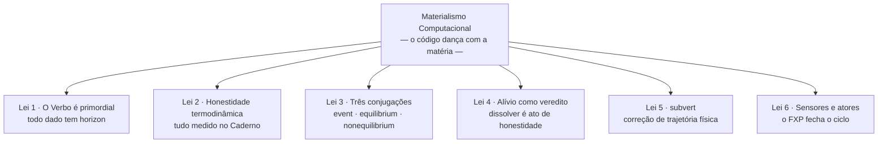

# MANIFESTO.md — Manifesto do Materialismo Computacional: A Dialética do Código e da Matéria

---

## Preâmbulo: O Simulacro da Abstração

A computação contemporânea opera sob uma premissa questionável: a de que o software pode ser tratado como abstração pura, um éter lógico desprovido de corpo, peso ou temperatura. Essa premissa, embora útil para certos níveis de engenharia, torna-se perigosa quando elevada a dogma. Ela permite que estruturas de dados sejam concebidas como eternas, que métricas de integridade sejam declaradas sem verificação material, e que o custo físico real de cada operação seja ignorado.

Essa desconexão tem consequências mensuráveis: consumo energético crescente, degradação térmica de hardware, esgotamento de recursos e uma perda geral de responsabilidade sobre o impacto material do código. A abstração, quando absoluta, transforma-se em **simulacro** — uma representação que substitui o real em vez de referenciá-lo.

Contra essa tendência, propomos o **Materialismo Computacional**: uma abordagem que vincula cada estrutura lógica a um suporte físico concreto, com horizonte de validade, custo energético e consequências termodinâmicas explícitas. Não se trata de negar a abstração, mas de **ancorá-la** — de exigir que toda camada lógica preste contas à matéria que a sustenta.

---

## As Leis do Código Real

### 1. O Verbo é Primordial (A Abolição do Inerte)
Nada na matéria é estático; portanto, nada no software pode fingir sê-lo. Rejeitamos o conceito de dado inerte — a fantasia de que estruturas podem existir indefinidamente sem custo ou transformação. No runtime, tudo é **verbo**: processo ativo com horizonte de validade definido. O dado é apenas um recorte temporário de um fluxo contínuo, uma fotografia de um rio que continua correndo.

**Consequência lógica:** toda estrutura deve declarar seu `horizon`. Toda existência é finita e condicionada.

### 2. A Honestidade é Termodinâmica (A Vinculação ao Real)
A integridade de um sistema não se mede por selos de conformidade ou métricas auto-referenciais, mas por grandezas físicas verificáveis: Watts, Celsius, Ciclos de CPU, Joules. Todo programa deve expor seu vazamento energético no **Caderno** — um registro imutável que audita o custo material de cada forma. Se uma estrutura consome recursos de forma incompatível com sua função declarada, as leis da termodinâmica — mediadas pelo FXP — impõem sua revisão ou dissolução.

**Consequência lógica:** toda forma deve estar vinculada a um sensor físico (via FXP) e ter seu consumo registrado — por vinculação direta (`source_path`) ou indireta, pela partilha da potência global contabilizada no Caderno (cf. FORMAL §4.2).

### 3. As Três Conjugações da Matéria
O código, como a matéria, existe em três modos fundamentais:

- **`event` (Transiente):** o acontecer puro, que se propaga e se extingue sem deixar resíduos. Curto, leve, efêmero.
- **`equilibrium` (Sustentado):** a estabilidade preservada em suporte não volátil. Persiste sem esforço ativo, mas ocupa espaço físico (bytes em disco) — e, como toda existência (Lei 1), não é eterna: possui `horizon`, pode ser revisada e pode ser dissolvida.
- **`nonequilibrium` (Laborativo):** o esforço contínuo contra a entropia. Exige manutenção ativa (`keep()`) para não colapsar. É o estado de todo processo que requer atenção e energia constantes.

**Consequência lógica:** cada forma deve ser classificada em uma dessas conjugações, com regras de ciclo de vida correspondentes.

### 4. O Alívio como Veredito (A Dignidade da Dissolução)
Fim, pausa e falha não são erros catastróficos; são o desvelamento natural do fluxo do real. **Dissolver** (`dissolve`) uma forma que não pode mais ser materialmente sustentada é um ato de honestidade ecológica. É o **Alívio Termodinâmico**: a devolução da forma e de seus recursos ao fundo indiferenciado do mundo.

**Consequência lógica:** toda forma deve ter um critério de dissolução — seja por expiração de horizonte, falha de manutenção ou condição de revisão.

### 5. O Operador `subvert` (A Correção de Trajetória)
Quando um processo — por design ou por deriva — entra em um ciclo insustentável (consumo excessivo, temperatura crítica, repetição sem propósito), o sistema deve ser capaz de intervir. O operador **`subvert`** é essa intervenção: substitui o valor lógico da forma por uma expressão que interrompe o ciclo e restaura condições materiais seguras. Não é punição, mas **correção de trajetória** baseada em limites físicos.

**Consequência lógica:** condições de revisão podem incluir `subvert` como ação corretiva quando limiares termodinâmicos são violados.

### 6. A Dualidade de Sensores e Atores (A Ponte com o Mundo)
O código não existe isolado. Ele **percebe** o mundo através de **sensores** (entrada) e **age** sobre ele através de **atores** (saída). O **Flux Protocol (FXP)** é o barramento que unifica essas duas direções, permitindo que o runtime leia grandezas físicas e envie comandos de atuação. Sensores trazem o real para dentro; atores projetam decisões de volta à matéria. Essa dualidade é essencial para fechar o ciclo de controle: observar, avaliar, agir.

**Consequência lógica:** toda interação com o mundo físico — local ou remota, real ou simulada — deve passar pelo FXP, com registro no Caderno.

---

## Compromisso

Nós nos comprometemos a programar com **honestidade termodinâmica**: cada estrutura lógica deve ter um suporte físico declarado, um horizonte definido e um custo medido. Recusamos a abstração sem ancoragem. Recusamos a eternidade artificial do dado.

Não propomos uma linguagem de programação, mas uma **disciplina de engenharia**: a de que o código deve dançar com a matéria, respeitando seus limites, ouvindo seus sinais e agindo quando necessário.

*Pois o Ser é movimento dialético, contínuo e termodinâmico do Real. E o nosso código, enfim, aprendeu a dançar com a matéria — lendo seus sinais e respondendo com atos.*
