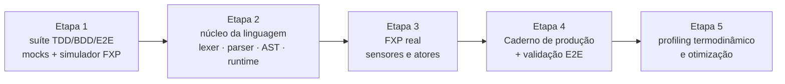

# PLAN.md — Plano de Execução em Cinco Etapas com FXP, Sensores, Atores e Análise de Riscos

---

### Introdução

Este documento define o roadmap de desenvolvimento técnico para a implementação da **VerboLang** em Rust ou C, estruturado em cinco etapas sequenciais. A arquitetura adota o **FXP (Flux Protocol)** como barramento de I/O que unifica **sensores** (entrada) e **atores** (saída), eliminando a necessidade de módulos separados para hardware. Inclui análise de riscos e estratégias de mitigação para leitura de sensores, atuação de atores, testes térmicos e a gestão de memória (“zero heap”). O objetivo é garantir desenvolvimento seguro, mensurável e alinhado aos princípios do Materialismo Computacional.



---

## Etapa 1: Pesquisa & Arquitetura de Escopo via Código em TDD, BDD & E2E

**Foco:** Estabelecer a suíte de testes de integridade física e comportamental antes de escrever qualquer linha do compilador ativo.

### 1.1 Cenários de Teste em BDD (Gherkin/Cucumber)

Os cenários comportamentais validam os limites de segurança da matéria, incluindo interações com sensores e atores através do FXP.

*   **Caso 1: Transição Automática de nonequilibrium para equilibrium (Fadiga de Atenção)**
    ```gherkin
    Funcionalidade: Salvaguarda de Atenção Cognitiva
      Cenário: Mudança de estado devido ao esgotamento da atenção do usuário
        Dado que a forma laborativa "PensarLivre" está ativa com um deadline de 3s
        Quando a leitura do sensor "attention" via FXP cai abaixo de 30% (ex: 15.0%)
        Então o runtime deve disparar uma transição "reclassify_as_equilibrium"
        E o estado da ideia deve ser gravado de forma persistente no disco
        E nenhuma CPU adicional deve ser consumida para tentar manter a atividade
    ```

*   **Caso 2: Subversão Poética por Sobrecarga Térmica com Atuação de Ator**
    ```gherkin
    Funcionalidade: Sabotagem de Processamento Predatório
      Cenário: Sobrecarga térmica em loop de trading especulativo
        Dado que a tarefa "TradingEspeculativo" está rodando em alta frequência
        Quando o sensor térmico da CPU atinge 86.5°C (limite de 85.0°C) via FXP
        Então o runtime deve invocar o operador "subvert()"
        E a ação "act(CpuPowerCap, 50)" deve ser enviada ao ator correspondente via FXP
        E o valor lógico de trading deve ser substituído pelo valor poético canônico "poesia_gerada_pelo_calor_do_silicio_e_resfriamento_da_mente"
        E o processamento da forma subvertida deve cessar no mesmo tick (dissolução em ≤ 1 tick virtual)
    ```

*   **Caso 3: Falha de Ator com Fallback**
    ```gherkin
    Funcionalidade: Resiliência de Atuação
      Cenário: Ator principal falha e fallback é acionado
        Dado que o ator "Ventoinha" não está respondendo
        Quando a temperatura excede 70°C e a ação é "act(Ventoinha, 200)"
        Então o FXP deve detectar a falha e tentar o ator alternativo "VentoinhaReserva" (extensão opcional registrada no diretório do FXP)
        E o Caderno deve registrar um alerta de falha e o fallback executado
    ```

### 1.2 Testes Unitários de Transição Física (TDD)

*   **Asserções de Finitude:** Verificar que formas `event` expiram corretamente após o `horizon`.
*   **Testes de Falha Controlada:** Injetar leituras de sensor com valor zero ou ausente (via FXP simulado) e assegurar que a dissolução executa a desalocação completa.
*   **Testes de Comandos de Atores:** Simular envio de `act` e validar que a mensagem FXP é serializada e entregue ao ator correto (mock).

### 1.3 Entregável da Etapa 1

*   Suíte de testes de regressão contínua (CI) contendo as especificações BDD escritas, mocks de sensores/atores e o esqueleto do simulador FXP para uso nos testes.

---

## Etapa 2: Desenvolvimento do Núcleo da Linguagem (Parser, AST e Grafo de Verbos)

**Foco:** Construir a gramática do movimento e o motor assíncrono de transições de estado na memória.

### 2.1 Lexer & Parser (Front-End)

*   Implementar o parser conforme a especificação EBNF (FORMAL.md v1.5).
*   A AST deve validar metadados materiais obrigatórios (`horizon`, `source_path`, `maintenance_deadline`, `cost_bytes`) e referências a sensores/atores simbólicos.

### 2.2 Motor de Grafo Assíncrono (Runtime)

*   **Abstracionismo de Tipos:** Garantir ausência de tipos inertes. Variáveis são instâncias com horizontes.
*   **Loop de Eventos:** Em Rust, usar `tokio`; em C, `epoll`/`poll`.
*   **Mecanismo `keep()`:** Canal de sinalização assíncrona para renovar `maintenance_deadline`.
*   **Integração com FXP:** O runtime deve ser capaz de consultar o FXP para leituras de sensores e enviar comandos `act` para atores de forma não bloqueante.

### 2.3 Entregável da Etapa 2

*   Compilador/interpretador de console que lê arquivos `.vl`, parseia para AST e carrega o estado inicial em memória, com suporte a um FXP simulado para leituras e atuações básicas.

---

## Etapa 3: Implementação do FXP (Sensores e Atores)

**Foco:** Desenvolver o Flux Protocol como camada única de I/O, integrando sensores e atores reais e simulados.

### 3.1 Arquitetura do FXP

*   **Registro de Dispositivos:** Um diretório dinâmico que mapeia nomes simbólicos (`cpu_temp`, `cpu_power`, `CpuPowerCap`, `Ventoinha`) para endpoints concretos (sysfs, ioctl, sockets, GPIO, etc.).
*   **Modos de Operação:** Real (hardware físico), Simulado (leituras sintéticas e atores de mentira), Híbrido (alguns reais, outros simulados).
*   **Comunicação:** Mensagens assíncronas com serialização binária compacta (ex: Cap'n Proto, FlatBuffers) para minimizar overhead.

### 3.2 Sensores (Entrada)

*   Mapear sensores reais:
    *   **Consumo Elétrico:** RAPL (`/sys/class/powercap/intel-rapl/...`), NVML para GPUs.
    *   **Temperatura:** `thermal_zone` (`/sys/class/thermal/thermal_zone*/temp`).
    *   **Atenção Humana:** Interface abstrata `AttentionSource` com backends: simulado (padrão), EEG, eye tracking, heurísticas de uso.
*   **Fallback:** Quando sensor real indisponível, usar modo simulado com modelos físicos simples (ex: temperatura sobe com potência).

### 3.3 Atores (Saída)

*   Implementar drivers de atuação:
    *   **Controle de potência da CPU:** RAPL power capping (sysfs).
    *   **Ventoinhas:** PWM via hwmon.
    *   **LEDs, relés:** GPIO, sysfs.
*   **Limites de Segurança:** Cada ator deve ter `min_value`, `max_value`, `safety_limit`. O FXP valida comandos contra esses limites antes de enviar.
*   **Fallback:** Atores alternativos podem ser configurados por política (ex: se ventoinha principal falhar, usar reserva).

### 3.4 Integração com o Runtime

*   API síncrona/assíncrona para leitura de sensores e envio de comandos.
*   Fila de comandos para atores, com prioridades e timeout.
*   Logging automático no Caderno (a cargo do AC, mas o FXP fornece os dados).

### 3.5 Entregável da Etapa 3

*   Módulo FXP completo, com registro de sensores e atores, drivers reais e simulados, testes unitários e de integração. O interpretador da Etapa 2 deve ser atualizado para usar o FXP real (ou simulado em CI).

**Mitigação de riscos:**

- **Leitura de sensores lenta ou não confiável:** implementar leituras assíncronas com timeout; cache de curta duração (ex: 100 ms) para evitar overhead; amostragem adaptativa.
- **Atores com latência alta ou falha:** fila de comandos com retry e fallback; monitoramento de saúde dos atores (heartbeat).
- **Atenção humana sem padrão:** interface abstrata e simulador como padrão; integração opcional com biossensores documentada.

---

## Etapa 4: Implementação do "Caderno" e Suíte de Validação

**Foco:** Contabilidade ecológica e validação de testes fim-a-fim, incluindo sensores e atores.

### 4.1 O Auditor do Caderno

*   Cálculo da integral de energia ativa por tempo (Joules) para cada forma.
*   Registro de todas as operações de I/O: leituras de sensores (valor, timestamp, sensor) e comandos a atores (ator, valor solicitado, valor aplicado, latência, custo energético da atuação).
*   Gravação assíncrona para evitar auto-interferência.
*   Logs de erro como “divergências de honestidade”, medidos fisicamente.

### 4.2 Execução de Testes End-to-End (E2E)

*   Submeter o interpretador integrado (com FXP) aos testes de estresse comportamental da Etapa 1.
*   **Testes de subversão térmica em CI:** usar **modo simulado do FXP** que reproduz cenários de alta temperatura e resposta de atores (ex: redução de potência), sem forçar hardware real a 85°C. Isso evita danos e permite automação.
*   Em ambiente de laboratório (hardware real), executar testes térmicos controlados com limites de segurança (ex: desligamento automático se a temperatura exceder 90°C) e supervisão.

### 4.3 Entregável da Etapa 4

*   Logs reais do Caderno exportados após execução ponta a ponta das cargas de teste (simuladas ou reais), validando a integridade ecológica do interpretador e a correta atuação de atores.

**Mitigação de riscos:**

- **Testes térmicos reais podem danificar equipamento:** usar simulador em CI; somente em casos excepcionais realizar testes reais com supervisão e proteções.
- **Overhead do Caderno pode distorcer medições:** implementar logging em buffer e flush periódico; medir overhead com ferramentas de profiling.
- **Comandos de atuação não registrados corretamente:** incluir contadores e verificações de consistência nos testes.

---

## Etapa 5: Revisão de Qualidade, Otimização e Padrões Compatíveis

**Foco:** Profiling termodinâmico profundo, eliminação de inércia oculta e refatoração com padrões de baixo nível.

### 5.1 Profiling de Memória e Energia

*   **"Vazamento Inerte":** Qualquer estrutura mantida em heap além do `horizon` é incoerente.
*   Ferramentas: Valgrind/Massif, PowerAPI, Flamegraphs/Perf.

### 5.2 Alinhamento com Patterns do Meta-Paradigma

*   **Zero-Cost Abstractions (Rust)**: abstrações resolvidas em tempo de compilação.
*   **Deterministic Memory Management (C)**: arenas e pools pré-alocados; proibir coletores de lixo.
*   **Validação Final de Integridade:** O AD realiza auditoria final, incluindo revisão do uso de memória e das interações FXP.

### 5.3 Entregável da Etapa 5

*   Compilador final com relatórios de performance provando ausência de vazamentos persistentes, overhead de FXP dentro dos limites e conformidade com o Materialismo Computacional.

**Mitigação de riscos:**

- **"Zero heap" é impossível em Rust ou C** (exceto para sistemas embarcados muito restritos): redefinir o critério para **"zero vazamento de heap após dissolução"** e **"uso de heap limitado a estruturas com horizonte explícito"**. Métricas objetivas: memória heap total em steady-state ≤ limite definido (ex: 10 MB para 10.000 formas).
- **Vazamentos de memória podem surgir de bibliotecas de terceiros:** auditoria cuidadosa de dependências; preferir crates/bibliotecas com gerenciamento determinístico.

---

## 6. Análise de Riscos e Estratégias de Mitigação (Resumo Consolidado)

### 6.1 Leitura de Sensores Físicos via FXP

| Risco | Impacto | Probabilidade | Mitigação |
|-------|---------|---------------|-----------|
| Sensores não disponíveis em todas as máquinas | Bloqueio do desenvolvimento/testes | Alta | Implementar modo simulado do FXP como fallback padrão; abstração com múltiplos backends. |
| Latência elevada na leitura de energia (RAPL) | Degradação do desempenho do runtime | Média | Leituras assíncronas com cache de curta duração; amostragem a cada N ticks. |
| Leituras imprecisas (ex: ±10% de erro) | Decisões erradas de subversão/dissolução | Média | Calibração com medidores externos; filtros (média móvel). |
| Atenção humana não tem sensor padrão | Funcionalidade dependente de hardware específico | Alta | Interface `AttentionSource`; simulador por padrão; integração opcional com biossensores. |

### 6.2 Atuação de Atores via FXP

| Risco | Impacto | Probabilidade | Mitigação |
|-------|---------|---------------|-----------|
| Ator com defeito causa dano físico | Alto | Baixa | Testes em simulador antes do hardware real; limites de segurança (`safety_limit`) rígidos; desligamento automático de emergência. |
| Latência de atuação acima do aceitável | Média | Média | Drivers de baixa latência; priorizar atores locais; fila de comandos com timeout. |
| Falha de comunicação com ator | Média | Média | Heartbeat e retry; fallback para ator alternativo. |
| Interferência entre múltiplos atores | Alto | Média | Controle de concorrência: fila, prioridades, validação de estado antes de atuar. |

### 6.3 Testes Térmicos

| Risco | Impacto | Probabilidade | Mitigação |
|-------|---------|---------------|-----------|
| Danos ao hardware por sobrecarga térmica real | Custo financeiro, interrupção | Média | Usar simulador em CI; testes reais apenas em ambiente controlado com limites de segurança (ex: desligamento a 90°C). |
| Testes térmicos não reproduzíveis em CI | Dificuldade para validar subversão | Alta | Simulador gera séries temporais de temperatura; cenários BDD com dados sintéticos. |
| Falsos positivos/negativos no teste de subversão | Perda de confiança na suíte | Média | Combinar testes unitários com mocks e E2E com simulador; revisão manual dos limiares. |

### 6.4 "Zero Heap" e Gerenciamento de Memória

| Risco | Impacto | Probabilidade | Mitigação |
|-------|---------|---------------|-----------|
| Exigência de zero heap é inviável em Rust/C | Bloqueio da implementação | Alta | Redefinir critério para "zero vazamento após dissolução" e "heap limitado"; usar arenas para formas de vida curta. |
| Vazamentos de memória em bibliotecas de terceiros | Crescimento não controlado | Média | Selecionar bibliotecas maduras; testar com ASan/Valgrind; monitorar uso de heap em longa execução. |
| Overhead de alocação/desalocação frequente | Aumento do consumo energético | Média | Pools de objetos pré-alocados; reutilização de buffers; alocadores customizados. |
| Dificuldade em garantir desalocação imediata após dissolução | Violação do princípio de honestidade | Média | Usar RAII (Rust) ou desalocação manual imediata (C); testes específicos de dissolução. |

### 6.5 Uso de Simulador de Hardware (via FXP)

**Recomendação:** Adotar um **simulador de hardware** como componente central do ambiente de CI para todas as etapas que dependem de leituras físicas e atuações. O simulador deverá:

- Gerar séries temporais de potência, temperatura, atenção e outros sensores com modelos físicos simples (ex: temperatura sobe proporcionalmente à potência).
- Simular atores com respostas plausíveis (ex: reduzir temperatura quando `CpuPowerCap` é acionado).
- Permitir injeção de falhas (sensor retornando 0, ator não respondendo, picos de temperatura).
- Ser determinístico para permitir testes repetíveis.

O simulador será implementado na Etapa 1 como parte dos mocks e evoluído para um módulo separado do FXP na Etapa 3. Testes com hardware real serão executados apenas em marcos importantes, com supervisão e limites de segurança.

---

## 7. Demanda registrada — dotar o modelo local de conhecimento da VerboLang

**Status:** em atendimento (set/2026) — caminho "a" implementado: [`docs/VBL-CHEATSHEET.md`](VBL-CHEATSHEET.md) criado e a UI de consulta local ganhou a alternância **"Modelo puro ↔ + VerboLang"** (a chave injeta o cheat sheet como prompt de sistema e o medidor de contexto passa a contar seu custo). **Pendente:** validação GQT do critério de aceite. **Responsáveis sugeridos:** AD (conteúdo canônico) + EC (validação contra a EBNF) + GQT (critério de aceite).

O modelo local do pipeline (Qwen3-4B-Instruct-2507, via vLLM — ver
`docs/SETUP-LOCAL-LLM.md`) **não detém conhecimento da VerboLang**: nenhum
trecho da especificação (`docs/FORMAL.md`) está no seu treino, e a janela de
4096 tokens do servidor impede despejar a spec inteira no contexto. Consequência
prática: qualquer tarefa da linguagem delegada ao modelo local **precisa levar
o contexto necessário no prompt** — sem isso, o modelo produz sintaxe e
semântica plausíveis porém falsas (alucinação documental).

Caminhos possíveis (não exclusivos, em ordem de custo):

| Caminho | Descrição | Custo |
|---|---|---|
| **a. "Cheat sheet" canônico** ✅ | Prompt de sistema compacto (≤ ~1.200 tokens) derivado da `FORMAL.md`: EBNF resumida, as três conjugações, regras de `horizon`/`keep()`/`subvert`, registro mínimo do FXP. Artefato versionado: [`docs/VBL-CHEATSHEET.md`](VBL-CHEATSHEET.md), injetável na UI de consulta (alternância "Modelo puro ↔ + VerboLang") e no PoC. | Baixo — documentação |
| **b. RAG sobre a spec** | Recuperação dos trechos relevantes da `FORMAL.md` por similaridade antes de cada consulta. Exige nó de embeddings (não cabe na VRAM junto do chat — ver `SETUP-LOCAL-LLM.md` §3.3) ou embeddings remotos. | Médio |
| **c. Fine-tune / LoRA** | Ajuste do Qwen3-4B com pares (pergunta, trecho da spec); inviável nos 6 GB de VRAM atuais, exige hardware maior. | Alto |

**Critério de aceite (caminho a):** sem a spec inteira no contexto, o modelo
local responde corretamente a perguntas de nível "escreva uma forma
`nonequilibrium` válida com `review` e `act`", validadas pelo GQT contra os
cenários BDD da Etapa 1. Enquanto o cheat sheet canônico não existir, todo uso
do modelo local para assuntos da linguagem deve assumir explicitamente que
**o modelo não conhece a VerboLang**.

---

## Conclusão

Com a integração de sensores e atores no FXP, o plano de execução torna-se mais coeso e alinhado à filosofia do Materialismo Computacional. A inclusão da análise de riscos e a adoção de um simulador para CI garantem que o desenvolvimento seja seguro e viável, mantendo o rigor termodinâmico e os critérios de aceite mensuráveis definidos no AGENTS.md.
