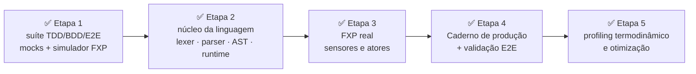

# PLAN.md — Plano de Execução em Cinco Etapas com FXP, Sensores, Atores e Análise de Riscos

---

> **Revisto em 02/09/2026 — plano executado.** As cinco etapas foram
> **concluídas** entre 30/08 e 01/09/2026, com relatórios e medidas em
> [`docs/reports/`](reports/) (revisão formal das metas:
> [`STAGE-5-GOALS-REVIEW.md`](reports/STAGE-5-GOALS-REVIEW.md)); primeira
> release: **`v2027.0.0-alpha.0`** (01/09/2026). O texto preserva o plano
> original; cada etapa traz o **status com evidências** e o §8 consolida o
> **roteiro pós-alpha**.

---

### Introdução

Este documento define o roadmap de desenvolvimento técnico para a implementação da **VerboLang** em Rust ([ADR-001](adrs/ADR-001-core-language.md)), estruturado em cinco etapas sequenciais. A arquitetura adota o **FXP (Flux Protocol)** como barramento de I/O que unifica **sensores** (entrada) e **atores** (saída), eliminando a necessidade de módulos separados para hardware. Inclui análise de riscos e estratégias de mitigação para leitura de sensores, atuação de atores, testes térmicos e a gestão de memória (“zero heap”). O objetivo é garantir desenvolvimento seguro, mensurável e alinhado aos princípios do Materialismo Computacional. O plano foi **executado integralmente** entre 30/08 e 01/09/2026; esta revisão registra o resultado medido de cada etapa e consolida a continuação no §8.



---

## Etapa 1: Pesquisa & Arquitetura de Escopo via Código em TDD, BDD & E2E

**Foco:** Estabelecer a suíte de testes de integridade física e comportamental antes de escrever qualquer linha do compilador ativo.

**Status:** ✅ **Concluída (30/08/2026)** — [`STAGE-1-REPORT.md`](reports/STAGE-1-REPORT.md). Entregas do §1.3: (a) CI = **GitHub Actions** + `make test`; (b) `MockFXP` (mock em processo) × `FXPSimulator` (simulador físico determinístico); (c) banco fixo de 20 prompts (`CHEATSHEET-PROMPTS.yaml`) — validado na v4 com **93,3 %** (§7); (d) linguagem **Rust** ([ADR-001](adrs/ADR-001-core-language.md)). Suíte: 3 cenários BDD (behave, 17 steps) + 63 testes pytest; **6/6 cláusulas de erro** cobertas (+9 adicionais).

### 1.1 Cenários de Teste em BDD (Gherkin/Cucumber)

Os cenários comportamentais validam os limites de segurança da matéria, incluindo interações com sensores e atores através do FXP.

*   **Caso 1: Transição Automática de nonequilibrium para equilibrium (Fadiga de Atenção)**
    ```gherkin
    Funcionalidade: Salvaguarda de Atenção Cognitiva
      Cenário: Mudança de estado devido ao esgotamento da atenção do usuário
        Dado que a forma laborativa "FreeThinking" está ativa com um deadline de 3s
        Quando a leitura do sensor "attention" via FXP cai abaixo de 30% (ex: 15.0%)
        Então o runtime deve disparar uma transição "reclassify_as_equilibrium"
        E o estado da ideia deve ser gravado como `.vl` canônico no diretório de persistência
        E o Caderno registra o evento de persistência com o SHA-256 do arquivo gravado
        E após a reclassificação a forma deixa de receber ticks de manutenção
        E 0 bytes permanecem retidos em heap para a forma (verificado com contadores do runtime)
    ```

*   **Caso 2: Subversão Poética por Sobrecarga Térmica com Atuação de Ator**
    ```gherkin
    Funcionalidade: Sabotagem de Processamento Predatório
      Cenário: Sobrecarga térmica em loop de trading especulativo
        Dado que a tarefa "SpeculativeTrading" está rodando em alta frequência
        Quando o sensor `cpu_temp` atinge 86.5°C (limite de 85.0°C) via FXP
        Então o runtime deve invocar o operador "subvert()"
        E a ação "act(CpuPowerCap, 50)" deve ser enviada ao ator correspondente via FXP
        E o valor lógico de trading deve ser substituído pelo valor poético canônico "poesia_gerada_pelo_calor_do_silicio_e_resfriamento_da_mente"
        E o processamento da forma subvertida deve cessar no mesmo tick (dissolução em ≤ 1 tick virtual)
    ```

*   **Caso 3: Falha de Ator com Fallback**
    ```gherkin
    Funcionalidade: Resiliência de Atuação
      Cenário: Ator principal falha e fallback é acionado
        Dado que o ator "Fan" não está respondendo
        Quando a temperatura excede 70°C e a ação é "act(Fan, 200)"
        Então o FXP detecta a falha (heartbeat) e aplica a política de fallback do registro, tentando o ator alternativo "ReserveFan" (extensão opcional)
        E o Caderno registra a tentativa primária, a falha e o fallback executado
    ```

### 1.2 Testes Unitários de Transição Física (TDD)

*   **Asserções de Finitude:** Verificar que formas `event` expiram corretamente após o `horizon`.
*   **Testes de Falha Controlada:** (i) leitura `0.0` é válida e avaliada normalmente — pode disparar regras; (ii) sensor ausente ou inacessível: nenhum `when` é avaliado, o Caderno registra alerta e não há disparo falso (FORMAL §4.7); (iii) a desalocação completa na dissolução é testada à parte, via expiração de `horizon`.
*   **Testes de Comandos de Atores:** Simular envio de `act` e validar que a mensagem FXP é serializada e entregue ao ator correto (mock).

### 1.3 Entregável da Etapa 1

*   Suíte de testes de regressão contínua (CI) contendo as especificações BDD escritas, mocks de sensores/atores e o esqueleto do simulador FXP para uso nos testes. Inclui: (a) configuração do runner de CI (nomear na entrega); (b) fronteira mock em processo (sem schema binário) × simulador físico (§6.5, evoluído na Etapa 3); (c) banco fixo de 20 prompts para validação do cheat sheet (§7); (d) decisão registrada Rust × C, com reancoragem dos orçamentos de memória/latência.

---

## Etapa 2: Desenvolvimento do Núcleo da Linguagem (Parser, AST e Motor de Tick)

**Foco:** Construir a gramática do movimento e o motor assíncrono de transições de estado na memória.

**Status:** ✅ **Concluída** — [`STAGE-2-REPORT.md`](reports/STAGE-2-REPORT.md). Núcleo em Rust (`vbl-lang` · `vbl-runtime` · `vbl-cli`); matriz de rastreabilidade **28/28 produções e 9/9 notas semânticas** ([`STAGE-2-TRACEABILITY-MATRIX.md`](reports/STAGE-2-TRACEABILITY-MATRIX.md)); 36 testes de transição; ASan/LSan limpo; persistência `nonequilibrium` → `equilibrium` como `.vl` canônico com SHA-256.

### 2.1 Lexer & Parser (Front-End)

*   Implementar o parser conforme a especificação EBNF (FORMAL.md).
*   A AST valida os obrigatórios (`value`, `horizon`) e a aplicabilidade dos opcionais por conjugação (`maintenance_deadline`/`exchange_mode` só em `nonequilibrium`, com deadline obrigatório nela; `cost_bytes` só em `equilibrium`), além das referências a sensores/atores simbólicos (FORMAL.md).

### 2.2 Motor de Tick Assíncrono (Runtime)

*   **Abstracionismo de Tipos:** Garantir ausência de tipos inertes. Variáveis são instâncias com horizontes — no nível da implementação, toda alocação é vinculada a uma forma com `horizon` explícito.
*   **Loop de Eventos:** Em Rust, usar `tokio`; em C, `epoll`/`poll`.
*   **Escalonador:** fila de prazos (min-heap por `horizon`/`maintenance_deadline`) sobre um relógio virtual injetável — 1 tick ≈ 1 s de parede em produção, dirigido pelo simulador em teste (FORMAL §4.2).
*   **`exchange_mode` (cf. FORMAL §3):** definir o efeito semântico pleno de `cooperation`/`extraction`; default: anotação de auditoria registrada no Caderno.
*   **Mecanismo `keep()`:** Canal de sinalização assíncrona para renovar `maintenance_deadline`.
*   **Integração com FXP:** O runtime deve ser capaz de consultar o FXP para leituras de sensores e enviar comandos `act` para atores de forma não bloqueante.

### 2.3 Entregável da Etapa 2

*   Compilador/interpretador de console que lê arquivos `.vl`, parseia para AST e carrega o estado inicial em memória, com suporte a um FXP simulado para leituras e atuações básicas. Inclui a persistência `nonequilibrium` → `equilibrium` como `.vl` canônico com SHA-256 registrado no Caderno (FORMAL §4.1).

---

## Etapa 3: Implementação do FXP (Sensores e Atores)

**Foco:** Desenvolver o Flux Protocol como camada única de I/O, integrando sensores e atores reais e simulados.

**Status:** ✅ **Concluída (31/08/2026)** — [`STAGE-3-REPORT.md`](reports/STAGE-3-REPORT.md). Schema de mensagem v1 definido **antes** dos drivers ([`FXP-SCHEMA-v1.md`](FXP-SCHEMA-v1.md)); registro com aliases/fallback; drivers reais (thermal_zone, RAPL, hwmon PWM, LED class) e simulados; barramento real/simulado/híbrido; transporte local/remoto (Unix/TCP); **6/6 atores obrigatórios** (FORMAL §6). Latências medidas: leitura real 6,45 µs · leitura remota 11,7 µs · roundtrip do schema ~86 ns.

### 3.1 Arquitetura do FXP

*   **Registro de Dispositivos:** Um diretório dinâmico que mapeia nomes simbólicos (`cpu_temp`, `cpu_power`, `CpuPowerCap`, `Fan`) para endpoints concretos (sysfs, ioctl, sockets, GPIO, etc.).
*   **Modos de Operação:** Real (hardware físico), Simulado (leituras sintéticas e atores de mentira), Híbrido (alguns reais, outros simulados).
*   **Comunicação:** Mensagens assíncronas com serialização binária compacta (ex: Cap'n Proto, FlatBuffers) para minimizar overhead.

### 3.2 Sensores (Entrada)

*   Mapear sensores reais:
    *   **Consumo Elétrico:** RAPL (`/sys/class/powercap/intel-rapl/...`), NVML para GPUs.
    *   **Temperatura:** `thermal_zone` (`/sys/class/thermal/thermal_zone*/temp`).
    *   **Atenção Humana:** Interface abstrata `AttentionSource` com backends: simulado (padrão), EEG, eye tracking, heurísticas de uso.
*   **Fallback:** Quando sensor real indisponível, usar modo simulado com modelos físicos simples (ex: temperatura sobe com potência).

### 3.3 Atores (Saída)

*   Implementar drivers de atuação:
    *   **Controle de potência da CPU:** RAPL power capping (sysfs).
    *   **Fans:** PWM via hwmon.
    *   **LEDs, relés:** GPIO, sysfs.
*   **Limites de Segurança:** Cada ator deve ter `min_value`, `max_value`, `safety_limit`. O FXP valida comandos contra esses limites antes de enviar.
*   **Fallback:** política do registro do FXP (primary → alternativos, com heartbeat); o runtime apenas recebe o resultado (FORMAL §4.3; cf. BDD Caso 3).

### 3.4 Integração com o Runtime

*   API síncrona/assíncrona para leitura de sensores e envio de comandos.
*   Fila de comandos para atores, com prioridades e timeout.
*   Logging automático no Caderno (a cargo do AC, mas o FXP fornece os dados).

### 3.5 Entregável da Etapa 3

*   Módulo FXP completo, com **schema de mensagem v1** (campos, opcodes, endianness, ack/timeout, transporte local × remoto) definido antes dos drivers; registro de sensores e atores; drivers reais e simulados; testes unitários e de integração. O interpretador da Etapa 2 deve ser atualizado para usar o FXP real (ou simulado em CI).

**Mitigação de riscos:**

- **Leitura de sensores lenta ou não confiável:** implementar leituras assíncronas com timeout; cache de curta duração (ex: 100 ms) para evitar overhead; amostragem adaptativa.
- **Atores com latência alta ou falha:** fila de comandos com retry e fallback; monitoramento de saúde dos atores (heartbeat).
- **Atenção humana sem padrão:** interface abstrata e simulador como padrão; integração opcional com biossensores documentada.

---

## Etapa 4: Implementação do "Caderno" e Suíte de Validação

**Foco:** Contabilidade ecológica e validação de testes fim-a-fim, incluindo sensores e atores.

**Status:** ✅ **Concluída (31/08/2026)** — [`STAGE-4-REPORT.md`](reports/STAGE-4-REPORT.md). Caderno de produção em formato binário compacto `.vcad` v1 com cadeia SHA-256 ([`NOTEBOOK-FORMAT-v1.md`](NOTEBOOK-FORMAT-v1.md)); gravação assíncrona em buffer; E2E **7/7** cenários no binário real; estresse de 60.000 eventos íntegro; verificador externo `vbl ledger-verify`; logs reais exportados em `logs/stage4/`.

### 4.1 O Auditor do Caderno

*   Cálculo da integral de energia ativa por tempo (Joules) para cada forma.
*   Registro de todas as operações de I/O: leituras de sensores (valor, timestamp, sensor) e comandos a atores (ator, valor solicitado, valor aplicado, latência, custo energético da atuação).
*   Gravação assíncrona para evitar auto-interferência.
*   Logs de erro como “divergências de honestidade”, medidos fisicamente.

### 4.2 Execução de Testes End-to-End (E2E)

*   Submeter o interpretador integrado (com FXP) aos testes de estresse comportamental da Etapa 1.
*   **Testes de subversão térmica em CI:** usar **modo simulado do FXP** que reproduz cenários de alta temperatura e resposta de atores (ex: redução de potência), sem forçar hardware real a 85°C. Isso evita danos e permite automação.
*   Em ambiente de laboratório (hardware real), executar testes térmicos controlados com limites de segurança (ex: desligamento automático se a temperatura exceder 90°C) e supervisão.

### 4.3 Entregável da Etapa 4

*   Logs reais do Caderno exportados após execução ponta a ponta das cargas de teste (simuladas ou reais), validando a integridade ecológica do interpretador e a correta atuação de atores.

**Mitigação de riscos:**

- **Testes térmicos reais podem danificar equipamento:** usar simulador em CI; somente em casos excepcionais realizar testes reais com supervisão e proteções.
- **Overhead do Caderno pode distorcer medições:** implementar logging em buffer e flush periódico; medir overhead com ferramentas de profiling.
- **Comandos de atuação não registrados corretamente:** incluir contadores e verificações de consistência nos testes.

---

## Etapa 5: Revisão de Qualidade, Otimização e Padrões Compatíveis

**Foco:** Profiling termodinâmico profundo, eliminação de inércia oculta e refatoração com padrões de baixo nível.

**Status:** ✅ **Concluída (31/08/2026)** — [`STAGE-5-REPORT.md`](reports/STAGE-5-REPORT.md); revisão formal das metas (AGENTS §4): [`STAGE-5-GOALS-REVIEW.md`](reports/STAGE-5-GOALS-REVIEW.md); validação laboratorial (soak 24 h **SOAK OK**, RAPL real com |ε| ≤ 0,019 %, perf fino, FXP híbrido em hardware): [`STAGE-5-LABORATORY.md`](reports/STAGE-5-LABORATORY.md). Metas reancoradas com números medidos: transição 65,7 µs · heap por forma 743 B/743 B/1 448 B · steady-state 7,43 MB @ 10.000 formas · overhead do Caderno 0,024 % CPU · `subvert` no mesmo tick 28,4 µs.

### 5.1 Profiling de Memória e Energia

*   **"Vazamento Inerte":** Qualquer estrutura mantida em heap além do `horizon` é incoerente.
*   Ferramentas: Valgrind/Massif, PowerAPI, Flamegraphs/Perf.

### 5.2 Alinhamento com Patterns do Meta-Paradigma

*   **Zero-Cost Abstractions (Rust)**: abstrações resolvidas em tempo de compilação.
*   **Deterministic Memory Management (C)**: arenas e pools pré-alocados; proibir coletores de lixo.
*   **Validação Final de Integridade:** O AD realiza auditoria final, incluindo revisão do uso de memória e das interações FXP.

### 5.3 Entregável da Etapa 5

*   Compilador final com relatórios de performance provando ausência de vazamentos persistentes, overhead de FXP dentro dos limites e conformidade com o Materialismo Computacional.

**Mitigação de riscos:**

- **"Zero heap" é impossível em Rust ou C** (exceto para sistemas embarcados muito restritos): redefinir o critério para **"zero vazamento de heap após dissolução"** e **"uso de heap limitado a estruturas com horizonte explícito"**. Métricas objetivas: memória heap total em steady-state ≤ limite definido (ex: 10 MB para 10.000 formas).
- **Vazamentos de memória podem surgir de bibliotecas de terceiros:** auditoria cuidadosa de dependências; preferir crates/bibliotecas com gerenciamento determinístico.

---

## 6. Análise de Riscos e Estratégias de Mitigação (Resumo Consolidado)

> **Saldo da execução:** os riscos abaixo foram tratados conforme o plano — simulador determinístico em CI, fallbacks honestos (FORMAL §4.7) e a redefinição de "zero heap" validada por churn (200 mil ciclos), ASan/LSan limpo e soak de 24 h ([`STAGE-5-LABORATORY.md`](reports/STAGE-5-LABORATORY.md) §6). As tabelas permanecem como registro histórico das decisões.

### 6.1 Leitura de Sensores Físicos via FXP

| Risco | Impacto | Probabilidade | Mitigação |
|-------|---------|---------------|-----------|
| Sensores não disponíveis em todas as máquinas | Bloqueio do desenvolvimento/testes | Alta | Implementar modo simulado do FXP como fallback padrão; abstração com múltiplos backends. |
| Latência elevada na leitura de energia (RAPL) | Degradação do desempenho do runtime | Média | Leituras assíncronas com cache de curta duração; amostragem a cada N ticks. |
| Leituras imprecisas (ex: ±10% de erro) | Decisões erradas de subversão/dissolução | Média | Calibração com medidores externos; filtros (média móvel). |
| Atenção humana não tem sensor padrão | Funcionalidade dependente de hardware específico | Alta | Interface `AttentionSource`; simulador por padrão; integração opcional com biossensores. |

### 6.2 Atuação de Atores via FXP

| Risco | Impacto | Probabilidade | Mitigação |
|-------|---------|---------------|-----------|
| Ator com defeito causa dano físico | Alto | Baixa | Testes em simulador antes do hardware real; limites de segurança (`safety_limit`) rígidos; desligamento automático de emergência. |
| Latência de atuação acima do aceitável | Média | Média | Drivers de baixa latência; priorizar atores locais; fila de comandos com timeout. |
| Falha de comunicação com ator | Média | Média | Heartbeat e retry; fallback para ator alternativo. |
| Interferência entre múltiplos atores | Alto | Média | Controle de concorrência: fila, prioridades, validação de estado antes de atuar. |

### 6.3 Testes Térmicos

| Risco | Impacto | Probabilidade | Mitigação |
|-------|---------|---------------|-----------|
| Danos ao hardware por sobrecarga térmica real | Custo financeiro, interrupção | Média | Usar simulador em CI; testes reais apenas em ambiente controlado com limites de segurança (ex: desligamento a 90°C). |
| Testes térmicos não reproduzíveis em CI | Dificuldade para validar subversão | Alta | Simulador gera séries temporais de temperatura; cenários BDD com dados sintéticos. |
| Falsos positivos/negativos no teste de subversão | Perda de confiança na suíte | Média | Combinar testes unitários com mocks e E2E com simulador; revisão manual dos limiares. |

### 6.4 "Zero Heap" e Gerenciamento de Memória

| Risco | Impacto | Probabilidade | Mitigação |
|-------|---------|---------------|-----------|
| Exigência de zero heap é inviável em Rust/C | Bloqueio da implementação | Alta | Redefinir critério para "zero vazamento após dissolução" e "heap limitado"; usar arenas para formas de vida curta. |
| Vazamentos de memória em bibliotecas de terceiros | Crescimento não controlado | Média | Selecionar bibliotecas maduras; testar com ASan/Valgrind; monitorar uso de heap em longa execução. |
| Overhead de alocação/desalocação frequente | Aumento do consumo energético | Média | Pools de objetos pré-alocados; reutilização de buffers; alocadores customizados. |
| Dificuldade em garantir desalocação imediata após dissolução | Violação do princípio de honestidade | Média | Usar RAII (Rust) ou desalocação manual imediata (C); testes específicos de dissolução. |

### 6.5 Uso de Simulador de Hardware (via FXP)

**Recomendação:** Adotar um **simulador de hardware** como componente central do ambiente de CI para todas as etapas que dependem de leituras físicas e atuações. O simulador deverá:

- Gerar séries temporais de potência, temperatura, atenção e outros sensores com modelos físicos simples (ex: temperatura sobe proporcionalmente à potência).
- Simular atores com respostas plausíveis (ex: reduzir temperatura quando `CpuPowerCap` é acionado).
- Permitir injeção de falhas (sensor retornando 0, ator não respondendo, picos de temperatura).
- Ser determinístico para permitir testes repetíveis.

O simulador será implementado na Etapa 1 como parte dos mocks e evoluído para um módulo separado do FXP na Etapa 3. Testes com hardware real serão executados apenas em marcos importantes, com supervisão e limites de segurança.

---

## 7. Demanda registrada — dotar o modelo local de conhecimento da VerboLang

**Status:** ✅ **atendido (31/08/2026)** — caminho "a" validado: banco fixo de 20 prompts × 3 execuções contra o Qwen3-4B local, com o cheat sheet injetado, **56/60 = 93,3% ≥ 90% — ACEITO** (`docs/cheatsheet/CHEATSHEET-VALIDATION.md`; histórico: v1 45% → v2 71,7% → v3 73,3% → v4 93,3%, iterações registradas no cabeçalho do banco de prompts). O cheat sheet continua canônico: mudanças na `FORMAL.md` devem refletir nele, e revalidações rodam com `make validate-cheatsheet`. **Responsáveis sugeridos:** AD (conteúdo canônico) + EC (validação contra a EBNF) + GQT (critério de aceite).

O modelo local do pipeline (Qwen3-4B-Instruct-2507, via vLLM — ver
`docs/setup/SETUP-LOCAL-LLM.md`) **não detém conhecimento da VerboLang**: nenhum
trecho da especificação (`docs/FORMAL.md`) está no seu treino, e a janela de
4096 tokens do servidor inviabiliza despejar a spec inteira no contexto. Consequência
prática: qualquer tarefa da linguagem delegada ao modelo local **precisa levar
o contexto necessário no prompt** — sem isso, o modelo produz sintaxe e
semântica plausíveis porém falsas (alucinação documental).

> **Medição (auditoria):** `FORMAL.md` tem ~2,0 mil palavras ≈ 2,8–3,8 mil
> tokens, conforme o tokenizer (estimativa; confirmar com o do Qwen). A spec
> quase cabe na janela de 4096 — sem folga para a resposta. Se uma versão
> aparada (sem mermaid/exemplos) couber com folga, adicionar à UI o toggle
> "spec aparada" além do cheat sheet.

Caminhos possíveis (não exclusivos, em ordem de custo):

| Caminho | Descrição | Custo |
|---|---|---|
| **a. "Cheat sheet" canônico** ✅ | Prompt de sistema compacto (≤ ~1.200 tokens) derivado da `FORMAL.md`: EBNF resumida, as três conjugações, regras de `horizon`/`keep()`/`subvert`, registro mínimo do FXP. Artefatos versionados: [`docs/cheatsheet/VBL-CHEATSHEET-AGENTS.md`](cheatsheet/VBL-CHEATSHEET-AGENTS.md) (denso, para agentes — injetado pela UI e pelo validador) e [`docs/cheatsheet/VBL-CHEATSHEET.md`](cheatsheet/VBL-CHEATSHEET.md) (completo — referência humana e fonte do denso); injetáveis na UI de consulta (alternância "Modelo puro ↔ + VerboLang") e no PoC. | Baixo — documentação |
| **b. RAG sobre a spec** | Recuperação dos trechos relevantes da `FORMAL.md` por similaridade antes de cada consulta. Exige nó de embeddings (não cabe na VRAM junto do chat — ver `docs/setup/SETUP-LOCAL-LLM.md` §3.3) ou embeddings remotos. | Médio |
| **c. Fine-tune / LoRA** | Ajuste do Qwen3-4B com pares (pergunta, trecho da spec); inviável nos 6 GB de VRAM atuais, exige hardware maior. | Alto |

**Critério de aceite (caminho a), mensurável:** banco fixo de 20 prompts (10 de
sintaxe — ex.: "escreva uma forma `nonequilibrium` válida com `review` e
`act`" — e 10 de semântica), 3 execuções cada; aceito se ≥ 90% das respostas
passam no verificador sintático (parser da Etapa 2 ou mini-validador dedicado
— o blueprint Python não parseia texto) e na rubrica semântica do GQT contra
os cenários BDD da Etapa 1; resultados versionados em `docs/`. Até lá, todo uso
do modelo local para assuntos da linguagem deve assumir explicitamente que
**o modelo não conhece a VerboLang**.

---

## 8. Roteiro pós-alpha — continuação registrada (janela `v2027.0.0-alpha.1`)

Com as cinco etapas concluídas, a continuação evolui por linhas de release
([`RELEASES.md`](RELEASES.md) — próxima janela: `alpha.1`, Setembro/2026) e
pelo trabalho futuro registrado nos relatórios. Nenhum item abaixo bloqueia a
release atual; a ordem reflete o custo/benefício medido.

| # | Item | Origem / justificativa |
|---|------|------------------------|
| 1 | **Dissolução O(1) amortizada** (tombstones + compaction no escalonador) | Gargalo medido por perf fino: `remove_form` = 22,7 % dos ciclos e `memcmp` = 28,8 % ([LABORATORY §5](reports/STAGE-5-LABORATORY.md)); proposta e risco (duplicação na `ordem`) em [GOALS-REVIEW §1](reports/STAGE-5-GOALS-REVIEW.md) |
| 2 | **Metering energético por forma** | Extensão prevista na FORMAL §4.2 ([STAGE-5-REPORT §10](reports/STAGE-5-REPORT.md)) |
| 3 | **Atuação física de `CpuPowerCap`** | No laboratório o host não expunha `constraint_0_power_limit_uw` — a subversão térmica real disparou, com falha honesta do ator (§4.7). Validar o capping real em host que exponha o constraint ([LABORATORY §1](reports/STAGE-5-LABORATORY.md)) |
| 4 | **Medidor externo de referência (wattímetro)** | A precisão Caderno × RAPL (|ε| ≤ 0,019 %) valida a contabilidade de partilha; a precisão do sensor contra referência independente segue em aberto ([LABORATORY §4](reports/STAGE-5-LABORATORY.md), escopo honesto) |
| 5 | **Backends reais de `AttentionSource`** (EEG, eye tracking, heurísticas de uso) | Hoje só o backend simulado (padrão) existe — cf. §3.2 |
| 6 | **Release `v2027.0.0-alpha.1`** | Congelar changelog e cortar a janela de Setembro ([`RELEASES.md`](RELEASES.md); ver CHANGELOG "Não lançado") |
| 7 | **Caminhos (b) RAG e (c) fine-tune do §7** | Registrados, não programados; a cada mudança na FORMAL, revalidar o cheat sheet com `make validate-cheatsheet` |
| 8 | **FXP v1.1 — extensões do fio** *(concluído nesta janela)* | Origem: §9 do [FXP-SCHEMA-v1](FXP-SCHEMA-v1.md) (que virou o contrato v1.1 — sem arquivo duplicado). CAPS, AUTH PSK, READ_BATCH, LZ4, FLAG_TIMESTAMP e beacon FXPD, tudo negociado/opt-in, fio padrão byte a byte v1.0. Medidas: lote 5,3× (117,4→22,3 µs no ciclo de 8 sensores), timestamp +5 ns, handshake +4 µs — [FXP-V1.1-REPORT](reports/FXP-V1.1-REPORT.md) |
| 9 | **FXP v1.2 — confidencialidade, dict, IPv6/SSM e mDNS** *(concluído nesta janela)* | Origem: §9 da v1.1 (as quatro extensões remanescentes). TLS 1.3 com pinning SHA-256 (`tcps`, rustls não expõe PSK — #174), dicionário LZ4 derivado do registro (id 2, gatilho no HELLO, zero bytes no fio), beacon em grupos IPv6 + SSM IPv4 (RFC 4607), mDNS/DNS-SD (`_fxp._tcp.local.`, feature `mdns` default-off). Tudo opt-in; fio default bit a bit v1.0/v1.1 (golden bytes intactos) — [FXP-V1.2-REPORT](reports/FXP-V1.2-REPORT.md) |
| 10 | **FXP v1.3 — SSM IPv6, TOFU, zstd treinado e 0-RTT** *(concluído nesta janela)* | Origem: §9 da v1.2 (as quatro extensões remanescentes). SSM IPv6 via `MCAST_JOIN_SOURCE_GROUP` bruto (RFC 3678 — socket2 não expõe a opção v6), TOFU com store JSON atômico (`tcps:...@tofu` + `--tofu-store`), zstd com dicionário TREINADO (id 3, bit `ZSTD` sempre com `DICT`; COVER sobre os nomes canônicos, 6,8× contra 5,6× do id 2) e resumo de sessão + 0-RTT (frame `CAPS` idempotente adiantado; `ACT`/`READ` nunca). Tudo opt-in; fio default bit a bit v1.0/v1.1/v1.2 (golden bytes intactos) — [FXP-V1.3-REPORT](reports/FXP-V1.3-REPORT.md) |
| 11 | **FXP v1.4 — TOFU estrito, rotação de pins, dict versionado, sessões entre processos e 0-RTT com RTT real** *(concluído nesta janela)* | Origem: §9 da v1.3 (as cinco extensões remanescentes). TOFU estrito `@tofu-estrito` (allow-list que nunca aprende), multi-pin `@sha256:H1,H2` com rotação por sobreposição (teto 8), zstd id 4 com verificação de dict no fio (`DICT_SYNC`: troca de versão+hash; divergente degrada ao id 3 com evento no Caderno), cache de sessões do SERVIDOR em disco (`--tls-sessions`; storage stateful — ticketer stateless desligaria o 0-RTT; ticket do CLIENTE bloqueado no rustls 0.23, #2287) e bench `v14_tls_0rtt_rtt` com proxy de atraso (0-RTT ≈ 22,4 ms × sem 0-RTT ≈ 25,5 ms × plano ≈ 6,8 ms a RTT 6 ms). Tudo opt-in; fio default bit a bit v1.0/v1.1/v1.2/v1.3 (golden bytes intactos) — [FXP-V1.4-REPORT](reports/FXP-V1.4-REPORT.md) |

---

## Conclusão

O plano cumpriu seu papel: as cinco etapas foram executadas com os critérios de aceite mensuráveis definidos no AGENTS.md, os riscos mapeados foram tratados com o simulador determinístico e os fallbacks honestos, e o resultado está ancorado em evidência — relatórios por etapa, benches criterion, auditor de heap, soak de 24 h e laboratório com RAPL real. A integração de sensores e atores no FXP mostrou-se coesa com a filosofia do Materialismo Computacional. A primeira release da linha (`v2027.0.0-alpha.0`) consolida esse estado; a continuação segue o roteiro do §8 e o calendário de releases ([`RELEASES.md`](RELEASES.md)), mantendo a honestidade termodinâmica como critério permanente.
