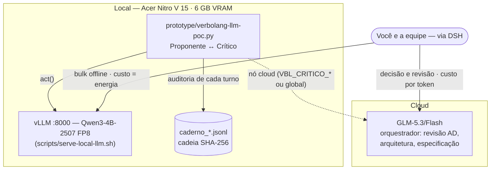

# SETUP-LOCAL-LLM.md — Modelo local via vLLM para o ecossistema VerboLang

> Hardware de referência: **Acer Nitro V 15 (ANV15-41)** — Ryzen 7 7735HS (8C/16T, 4.83 GHz),
> RTX 4050 Mobile **6 GB GDDR6** (Ada, FP8/INT4), Radeon 680M iGPU, **30 GB DDR5** (+23 GB swap),
> NVMe 476 GB (~306 GB livres), Ubuntu 26.04 (kernel 7.0), driver NVIDIA open 595.84,
> vLLM 0.28.0 + PyTorch (pyenv 3.13.7), Docker 29.1.3.

> **Decisão vigente:** o pipeline mantém apenas **dois modelos** — o orquestrador
> **GLM-5.3/Flash (cloud, via DSH)** e o único modelo local, **Qwen3-4B-Instruct-2507**
> (FP8), servido por `scripts/serve-local-llm.sh`. Os demais candidatos avaliados em
> ago/2026 foram descartados (ver §1); os detalhes da pesquisa completa constam do
> registro da sessão de trabalho de ago/2026.
>
> **Uso primário do modelo local:** testes de comunicação entre LLMs via VerboLang
> (PoC `verbolang-llm-poc.py` — dois agentes conversando sob o runtime, com revisões,
> Caderno e cadeia SHA-256), consulta direta pela **UI dedicada** (§4 — aberta
> automaticamente pelo script de serviço) e bulk offline: rascunhos Gherkin,
> casos de erro da EBNF, stubs Rust/C e FXP. O serviço de embeddings (§3.3) é
> infraestrutura opcional do detector de loops, não um terceiro modelo de trabalho.

---

## 0. Pré-requisito crítico: nós de dispositivo NVIDIA

O driver carrega (`lsmod` OK, NVRM 595.84) mas **`/dev/nvidia*` não existem** e o
`nvidia-modprobe` não está instalado — sem isso, `nvidia-smi` falha (exit 9) e o vLLM
não vê a GPU. Correção (uma vez, com sudo):

```bash
sudo apt install nvidia-modprobe
sudo nvidia-modprobe -u -c=0     # cria /dev/nvidia0, /dev/nvidiactl, /dev/nvidia-uvm
nvidia-smi                       # deve listar a RTX 4050 com 6144 MiB
```

Se persistir após upgrade de kernel: `sudo apt install --reinstall nvidia-driver-595-open` e reinicie.

---

## 1. Cenário 2026 → decisão de 2 modelos (pesquisa ago/2026, fontes no final)

A pesquisa de ago/2026 avaliou os candidatos abaixo para esta máquina (6 GB VRAM /
30 GB RAM). A decisão final foi **não** manter um segundo modelo local:

| Modelo | Veredito |
|---|---|
| **Qwen3-4B-Instruct-2507** | ✅ **Mantido** — 4B denso, FP8 ~4,8 GB, 100% em VRAM (~30 tok/s medidos); único modelo local |
| Qwen3-Coder-30B-A3B-Instruct | ❌ Descartado — exigia offload GPU+CPU (UD-Q3/Q4, ~12–18 GB, 17 GB de download) com ~10–20 tok/s estimados; a qualidade extra não compensou a complexidade operacional |
| Mellum2 (JetBrains, 12B MoE) | ❌ Descartado — papel coberto pelo par GLM cloud + Qwen3-4B |
| GPT-OSS-20B | ❌ Descartado — ~13 GB MXFP4, exige offload |
| Devstral Small (24B) | ❌ Descartado — denso, Q4 ~13 GB, offload lento |
| GLM-4.5-Air (106B-A12B) | ❌ ~60 GB mesmo em Q4 |
| GLM-5 (745B) | ❌ inviável local — é o orquestrador cloud |
| Kimi K2.6 / DeepSeek V3.2 / Llama 4 | ❌ classe servidor |

---

## 2. Recomendação estratégica — pipeline de 2 camadas

| Camada | Modelo | Papel no VerboLang | Custo |
|---|---|---|---|
| **Orquestrador** | GLM-5.3/flash (cloud, via DSH) | Revisão AD (ontologia), arquitetura, decisões de especificação, refatorações grandes, contexto longo | por token |
| **Local único** | Qwen3-4B-2507 FP8 (vLLM, GPU-only) | **Testes de comunicação inter-LLM via VerboLang** (PoC `verbolang-llm-poc.py`: cada agente é um ator no FXP, sensores medem o diálogo, `subvert` derruba loops), consulta direta pela UI local (§4) e bulk offline: rascunhos Gherkin, casos de erro da EBNF, stubs Rust/C e FXP — privado (nada sai da máquina), custo zero por token | energia |



Divisão prática: o GLM cloud decide e revisa; o Qwen3-4B executa o volume local.
Quando a qualidade do 4B não bastar para uma tarefa pesada (ex.: o parser completo
da Etapa 2), a tarefa escala para o GLM — critério do AD, sem modelo local intermediário.

### Por que não um GLM local
GLM-5 é 745B e GLM-4.5-Air 106B — classe servidor. O GLM já atua como orquestrador
cloud; localmente, o Qwen3-4B cobre o bulk com o hardware que existe.

---

## 3. Instalação

### 3.0 Lições de VRAM em 6 GB (validadas na prática, ago/2026)

O Qwen3-4B-FP8 só subiu após 5 iterações — cada uma com causa distinta:

1. **Desktop GNOME reserva ~0,4 GB** — o vLLM enxerga 5,64 GiB, não 6,0
2. **CUDA graphs + torch.compile estouram o orçamento** → `--enforce-eager` (custo ~10–15% em decode, libera ~0,6 GB)
3. **KV cache em FP8** (`--kv-cache-dtype fp8`) — metade da memória; Ada tem FP8 nativo
4. **Sampler do flashinfer exige nvcc** (JIT em C++!) → `VLLM_USE_FLASHINFER_SAMPLER=0` usa o caminho nativo PyTorch
5. **`--attention-backend TRITON_ATTN`** + `--kernel-config '{"enable_jit_warmup": false, ...}'` — evita os demais caminhos que exigem toolkit CUDA
6. `PYTORCH_CUDA_ALLOC_CONF=expandable_segments:True` + `--max-num-seqs 16` + ctx 4096

Todos já embutidos em `scripts/serve-local-llm.sh`.

### 3.1 Via vLLM

```bash
# Perfil validado: Qwen3-4B-Instruct-2507-FP8, sobe em ~90 s (pesos em cache)
bash scripts/serve-local-llm.sh    # http://127.0.0.1:8000/v1
```

Resultado do teste de aceitação:
- `GET /v1/models` → `qwen3-4b` (root: Qwen3-4B-Instruct-2507-FP8) ✓
- `POST /v1/chat/completions` → 37 tokens em ~2,0 s (~30 tok/s) ✓
- KV cache: 9.344 tokens, concorrência 2,28x @ 4096 ctx ✓

Medições no uso real (PoC inter-LLM, ago/2026):
- Diálogo de 23 turnos: 5.656 tokens, latência 2,7–4,9 s por chamada (~55–70 tok/s ponta a ponta)
- Os quatro fins de conversa validados contra o LLM real: **Alívio** (`horizon`), **notify_shutdown** (orçamento de tokens), **subvert** (repetição sem propósito) e **colapso** (manutenção expirada)
- Caderno: cadeia SHA-256 íntegra em todas as execuções

> Nota honesta: para **um usuário** com offload pesado, llama.cpp com GGUFs
> quantizados (`--n-gpu-layers` + `-ct q8_0`) costuma dar throughput melhor e é mais
> simples de tunar; vLLM brilha com concorrência (vários subagentes batendo no
> endpoint). Teste os dois; o endpoint OpenAI-compatível é igual para o DSH.
> Se um dia instalar o toolkit CUDA (`sudo apt install nvidia-cuda-toolkit`),
> os mitigações 4/5 tornam-se desnecessários e o flashinfer volta a ser útil.

### 3.2 Alternativa GPU-only (rápida, sem offload)

```bash
vllm serve Qwen/Qwen3-4B-Instruct-2507-FP8 \
  --max-model-len 4096 --gpu-memory-utilization 0.90 --kv-cache-dtype fp8 \
  --enforce-eager --attention-backend TRITON_ATTN --max-num-seqs 16 --port 8001
```

### 3.3 Nó de embeddings (opcional) — detector de loop do PoC inter-LLM

O `verbolang-llm-poc.py` mede `dialogo_loop_risk` por embeddings. **Sem** nó de
embeddings, cai automaticamente para hashing de n-gramas (100% stdlib, sem VRAM)
— suficiente para os testes cotidianos. Para similaridade semântica real:

```bash
vllm serve Qwen/Qwen3-Embedding-0.6B --task embed --port 8002
VBL_EMBED_URL=http://127.0.0.1:8002/v1 python3 prototype/verbolang-llm-poc.py
```

- **Conflito de VRAM:** os 6 GB não comportam o chat e o embedding simultaneamente
  (o chat reserva 90% da VRAM). Rode o nó de embeddings com o chat desligado ou
  em outra máquina.
- O método ativo (HTTP × hashing) fica **registrado no Caderno** — cada
  `loop_risk` carrega a procedência da medição.
- Para o segundo nó em cloud (GLM-5.3/Flash) — **validado dos dois lados, ago/2026**:
  assinantes do Coding Plan devem usar a rota `https://api.z.ai/api/coding/paas/v4`;
  a rota pay-as-you-go (`/api/paas/v4`) devolve HTTP 429 "Insufficient balance".
  Atalho de topologia: `VBL_AGENTE_URL=<rota> VBL_AGENTE_MODEL=glm-5.3-flash
  VBL_AGENTE_KEY_ENV=ZAI_API_KEY`. O GLM-5.3-Flash é *reasoning*: com
  `VBL_MAX_TOKENS=512`, 1 de 7 turnos veio vazio (o reasoning consumiu o
  orçamento) — use 768+ ou aceite o alerta do Caderno.

---

## 4. Consulta local via UI dedicada (decisão vigente, set/2026)

> **Decisão: a integração agente-DSH ↔ modelo local fica dispensada.** Um turno
> do agente DSH carrega ≥ 12k tokens só de prompt fixo (system + schemas de
> tools — medido nos registros de sessão: 11.565–11.801 tokens já no primeiro
> turno). O servidor a 4096 nunca os comportaria, e subir o contexto é
> inviável em ~5,6 GiB com pesos FP8 (pool de KV ≈ 9,3k tokens: o Qwen3-4B
> gasta 72 KiB/token de KV em fp8). O modelo local permanece para o PoC
> inter-LLM, scripts bulk e **consulta direta pela UI** abaixo — que envia ao
> servidor apenas o que você digita.

### 4.1 UI de consulta (`scripts/chat.html`)

- Single-file, zero dependências: streaming SSE direto ao endpoint
  OpenAI-compatível (o vLLM já responde preflight com `allow-origin: *`).
  Identidade visual: `scripts/verbolog.svg` (logo no cabeçalho, favicon e
  estado vazio) — traço de osciloscópio mergulhando num "V": a medição do FXP
  interrompida pelo verbo.
- `serve-local-llm.sh` abre tudo sozinho: um vigia em subshell espera o
  `/v1/models` responder 200 (~90 s com pesos em cache), sobe um
  `python3 -m http.server` na porta **8188** (só loopback) e chama o navegador.
  O servidor estático morre junto com o vLLM. Desativar: `LOCAL_LLM_UI=0`;
  outra porta: `LOCAL_LLM_UI_PORT=<porta>`.
- **Medidor de contexto** no cabeçalho — prompt + resposta vs. teto de 4096
  (verde < 65%, amarelo < 85%, vermelho acima), usando o `usage.prompt_tokens`
  real do último turno (SSE com `stream_options.include_usage`) e estimativa
  ~4 chars/token entre turnos. **✂ Podar** remove o par (pergunta, resposta)
  mais antigo; **Nova** zera a conversa.
- A chave vai no fragmento da URL (`#k=…`), que o navegador não envia ao
  servidor estático. URL manual:
  `http://127.0.0.1:8188/scripts/chat.html#k=<chave>&u=<base-url>&m=<modelo>&c=<ctx>`
- **Alternância "Modelo puro ↔ + VerboLang"**: seletor de ícones flutuante no
  canto inferior da página (chip = modelo puro; livro = + VerboLang; tooltip
  traz o estado, inclusive o custo do cheat sheet em tokens). O modo
  "+ VerboLang" injeta o cheat sheet canônico
  ([`VBL-CHEATSHEET.md`](VBL-CHEATSHEET.md)) como prompt de
  sistema e conta o custo dele no medidor de contexto. O prompt de sistema é
  fixo e localizado (sem editor na UI). Lembre: o modelo local
  **não conhece a linguagem** sem isso (demanda em [`PLAN.md`](PLAN.md) §7) —
  para consultas sobre a VerboLang, ligue o modo e mantenha folga no medidor.
  As perguntas sugeridas na home acompanham o modo (gerais no puro; da
  linguagem no + VerboLang).
- **Temas e idiomas (botões de ícone)**: sol/contraste/lua ciclam os três
  temas (claro, metal, escuro); o globo cicla os sete idiomas da interface
  (português, inglês, chinês, russo, híndi, africâner e árabe — com RTL);
  o tooltip mostra o estado atual. Persistidos em `localStorage`.
- **Sessões em abas**: várias conversas simultâneas, cada uma com histórico,
  DOM e medidor próprios; a primeira pergunta batiza a aba. `+` abre nova
  sessão, `×` fecha (se for a última, zera). Geração é uma por vez (global) —
  tentar enviar de outra aba mostra aviso. Sessões vivem em memória:
  recarregar a página começa limpo.
- **Respostas em markdown completo**: títulos, listas, citações, tabelas, links
  e **diagramas Mermaid** (vendido em `scripts/vendor/`, MIT — tema acompanha a
  UI). Botão **copiar** em cada resposta devolve o markdown bruto. Delimitadores
  LaTeX que o modelo vaza (`\( \)`, `\[ \]`, `$$ $$`) são **renderizados com
  KaTeX** (vendido em `scripts/vendor/katex/`, MIT — fração empilhada, radicais
  e símbolos reais; TeX inválido fica como texto cru) — sem tocar em blocos de
  código.
- **Perguntas sugeridas**: o prompt de sistema instrui o modelo a terminar cada
  resposta com 7 perguntas de acompanhamento num bloco marcado (`[q]…[/q]`); a
  UI extrai o bloco, remove-o do texto exibido/copiado/histórico e renderiza as
  perguntas como botões (no modo "+ VerboLang" a instrução pede que explorem a
  gramática: formas, conjugações, `review`, `act`, FXP). O custo da instrução
  entra no medidor de contexto; modelo pequeno pode desobedecer ao formato —
  nesse caso a resposta simplesmente aparece sem botões. O parser tolera
  também o `[/q]` órfão (modelo que esquece o `[q]` de abertura), linhas de
  pergunta sem numeração e blocos não fechados. Contra o esquecimento do
  modelo: um **lembrete curto** acompanha a última mensagem do usuário só na
  requisição (histórico e cópia ficam limpos; o custo entra no medidor) e, se
  o bloco não vier, uma **segunda chamada leve** (só a cauda da resposta +
  `max_tokens` 256) pede a lista de 7 perguntas diretamente.
- **Tipografia**: Inter (texto corrido; pesos 400/600/700) e Iosevka (código e
  terminal; peso 400, subset latin+simbolos), **auto-hospedadas** em
  `scripts/fonts/` (SIL OFL 1.1 — proveniência em
  `scripts/fonts/LICENSE-FONTS.txt`), com fallback do sistema para glifos fora
  dos subsets — nenhuma requisição de fonte sai da máquina.

### 4.2 Por que não via DSH (números medidos, set/2026)

1. **Prompt fixo de agente ≈ 11,5–11,8k tokens** (system + tools + primeira
   mensagem) → só caberia com `--max-model-len ≥ 16k`; com FP8 o pool de KV
   (≈9,3k) nem cobre 8192 de janela.
2. **Clamp do pi-ai** (`@earendil-works/pi-ai`, `simple-options.js`): a saída é
   `min(maxTokens, contextWindow − estimativa_do_prompt − 4096)` com piso de
   1 token (`CONTEXT_SAFETY_TOKENS = 4096`). Com `contextWindow ≤ 8192` a
   saída colapsa para **1 token** em qualquer prompt — o padrão correto para
   esse clamp seria `contextWindow == max-model-len` do servidor.
3. **Compactação falha em cascata na rota local**: sem summarizer configurado,
   `dsh-compaction-basic` usa o próprio modelo da sessão
   (`target = configured ?? latest ?? agentTarget`); o pedido de resumo carrega
   a história inteira (>4096) → 400 → turno falha. Exigiria `modelPolicies`
   apontando o summarizer para o cloud (`zai/glm-5.3-flash`).

Receita para reabrir o experimento (hardware novo, ou aceitando os tradeoffs):
pesos **INT4** (AWQ/GPTQ, ~2,6–2,9 GB) liberam ~2 GB → pool de KV ≈ 25–28k
tokens → `--max-model-len 20480–24576` + summarizer da rota local no cloud +
`contextWindow == max-model-len` no settings do DSH. Ressalva honesta: a
qualidade INT4 cai exatamente na precisão de tool-calling que o harness exige.

---

## 5. Fontes (pesquisa via LangSearch, ago/2026)

- Qwen3-4B-Instruct-2507-FP8 (HF, modelo servido localmente): https://huggingface.co/Qwen/Qwen3-4B-Instruct-2507-FP8
- Qwen3-Embedding-0.6B (HF, nó opcional de embeddings do PoC): https://huggingface.co/Qwen/Qwen3-Embedding-0.6B
- GLM-5 (745B, MIT, fev/2026 — orquestrador cloud): https://localaimaster.com/models/glm-5 · https://effloow.com/articles/glm-5-open-source-frontier-model-setup-guide-2026
- GLM-4.5-FP8 (HF, MIT): https://huggingface.co/zai-org/GLM-4.5-FP8
- Melhores LLMs locais por tier de VRAM (ago/2026): https://benchlm.ai/best/local-llm
- LLMs locais por tarefa em 4/6/8 GB: https://www.mayhemcode.com/2026/06/best-local-llms-for-4gb-6gb-and-8gb.html

> Os candidatos descartados (Qwen3-Coder-30B-A3B, Mellum2, GPT-OSS-20B,
> Devstral Small e a análise de KV-cache do 30B) e suas fontes de pesquisa foram
> removidos nesta revisão do documento; a pesquisa completa de ago/2026 permanece
> no registro da sessão de trabalho.

> Números de tok/s são estimativas da comunidade para a classe de hardware — valide
> com o seu workload antes de fechar a arquitetura (princípio da honestidade
> termodinâmica: meça, não presuma).
