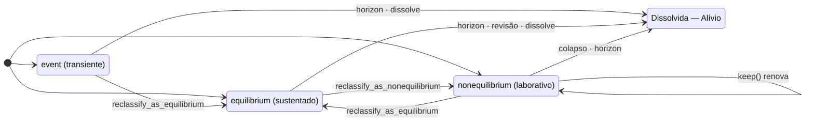

# As três conjugações

**Neste capítulo:** os três modos de existir de uma forma — `event`,
`equilibrium` e `nonequilibrium` —, os atributos de cada um, as regras de
horizonte e manutenção, e as transições legais entre conjugações.

## A tabela que resume tudo

| | `event` | `equilibrium` | `nonequilibrium` |
|---|---|---|---|
| **Modo de ser** | transiente — o acontecer puro | sustentado — repouso em suporte não volátil | laborativo — esforço contra a entropia |
| **Manutenção** | nenhuma | nenhuma | **obrigatória** — `keep()` ou revisão ativa |
| **Custo típico** | ciclos de CPU (`CpuCycles`) | bytes em disco (`DiskBytes`) | potência (`PowerWatts`) |
| **Como morre** | `horizon` esgotado | `horizon` esgotado · revisão · `dissolve` | colapso (manutenção vencida) · `horizon` · revisão |
| **Atributo exclusivo** | — | `cost_bytes` | `maintenance_deadline`, `exchange_mode` |

O que **todas** exigem, nesta ordem: `value` e `horizon`. Sem exceção — a
Lei 1 do [manifesto](../../../docs/MANIFESTO.md): *toda existência é finita*.

```verbolang
// event mínima: piscada de um pensamento
event Piscada {
    value: "impulso_curto",
    horizon: 2s
}

// equilibrium mínima: um registro persistente com custo declarado
equilibrium Registro {
    value: "documento_persistente",
    horizon: 86400s,
    cost_bytes: 4096
}

// nonequilibrium mínima: trabalho ativo sob vigilância
nonequilibrium Servico {
    value: "trabalho_continuo",
    horizon: 600s,
    source_path: "cpu_power",
    maintenance_deadline: 5s,
    exchange_mode: "cooperation"
}
```

## Atributos opcionais

| Atributo | Conjugações | Significado |
|---|---|---|
| `source_path: "nome"` | todas | o sensor FXP que alimenta as revisões da forma (nome **simbólico** — nunca `/sys/...`) |
| `currency: "..."` | todas | a moeda da contabilidade: `"CpuCycles"`, `"DiskBytes"` ou `"PowerWatts"` (padrão: o da conjugação). Afeta só a contabilidade, nunca a lógica |
| `classification: "..."` | todas | anotação de auditoria (ex.: `"Transiente"`), sem efeito no runtime |
| `exchange_mode: "..."` | só `nonequilibrium` | `"cooperation"` ou `"extraction"` — anotação de auditoria registrada no Caderno |
| `cost_bytes: N` | só `equilibrium` | o custo em bytes de persistir a forma; ausente, vale o tamanho real gravado |

Cada atributo aparece **no máximo uma vez** por forma, e na conjugação
errada é erro de compilação — um `equilibrium` com `maintenance_deadline`
não compila, porque persistência sem vigilância é exatamente o que ela
promete não exigir.

## O horizonte é absoluto

`horizon` conta desde a **criação** da forma e **nada o renova** — nem
reclassificação, nem `keep()`, nem revisão. É o tempo de vida total, não um
*idle timeout*. Esgotado o horizonte, a forma se dissolve por **Alívio
Termodinâmico** (evento `dissolve_horizon` no Caderno) e seus recursos
voltam no mesmo tick.

Durações aceitam decimais e as unidades `s`, `ms`, `us`, `ns` — mas a
avaliação acontece na granularidade do tick (1 s virtual por padrão): um
`horizon: 2.5s` é honesto na contabilidade e arredonda na prática.

## Manutenção: o preço do laborativo

Um `nonequilibrium` é trabalho ativo — e trabalho ativo sem vigilância
colapsa. O prazo (`maintenance_deadline`) é renovado por dois caminhos:

1. **`keep(Forma)` explícito** no bloco `main` (renovação manual);
2. **manutenção implícita** do runtime: enquanto a forma tiver **ao menos
   uma regra de revisão ativa** — uma regra própria que ainda não a dissolveu
   nem a subverteu —, o runtime renova a cada tick.

Sem os dois, o colapso chega no primeiro vencimento
(`collapse_maintenance` no Caderno). É a semântica, não um defeito: *trabalho
sem vigilância colapsa*.

```verbolang
// Sem review e sem keep: colapsa 5s depois de criada
nonequilibrium Efemero {
    value: "experimento_sem_cuidado",
    horizon: 300s,
    maintenance_deadline: 5s
}

main {
    every 10s { }   // ninguém cuida — colapso no tick 5
}
```

```verbolang
// Com revisão ativa: o runtime mantém implicitamente a cada tick
nonequilibrium Cuidado {
    value: "experimento_vigilado",
    horizon: 300s,
    source_path: "cpu_power",
    maintenance_deadline: 5s
}

review Cuidado {
    when cpu_power > 400W -> notify_shutdown
}
```

> [!WARNING]
> `keep` só existe no bloco `main` — escrever `keep` como ação de uma
> `review` é erro de compilação. As ações de revisão são:
> `dissolve`, `subvert`, `reclassify_as_equilibrium`,
> `reclassify_as_nonequilibrium`, `notify_shutdown` e `act` (capítulo 4).

## Persistência: o que `equilibrium` promete

Ao reclassificar qualquer forma para `equilibrium` — ou ao criar uma — ela é
gravada como `.vl` canônico **reparseável** no diretório de persistência do
runtime (`--persist-dir`, padrão `persistencia/`). O Caderno registra o
caminho e o SHA-256 do conteúdo; `cost_bytes` ausente passa a valer o
tamanho real gravado. Na inicialização, o runtime recarrega as
`equilibrium` persistidas cujo `horizon` não venceu. Persistir não é gratuito
— é contabilizado, como tudo.

## Transições legais



Três cláusulas que salvam auditoria:

- **Não há retorno a `event`.** `reclassify_as_nonequilibrium` sobre uma
  forma `event` é erro de runtime **registrado** no Caderno, e a forma
  permanece `event`.
- **As regras de revisão sobrevivem às transições** e continuam ativas na
  `equilibrium` — o que cessa lá é apenas a manutenção implícita.
- **Disparo sem efeito é no-op auditado**: reclassificar para
  `equilibrium` uma forma que já é `equilibrium` gera evento de avaliação,
  sem transição e sem dissolução.

> [!TIP]
> Experimente o ciclo completo com o simulador:
> `vbl run examples/example1_free_thinking.vl --ticks 12 --set attention=100
> --at 4:attention=10 --ledger tmp-logs/reclass.vcad` — a atenção cai no
> tick 4 e a forma vira `equilibrium` na hora.

## Próximo passo

[Reviews — quando a matéria reage](revisoes.md): as regras, a ordem de
avaliação no tick e a semântica fina de `subvert`.
