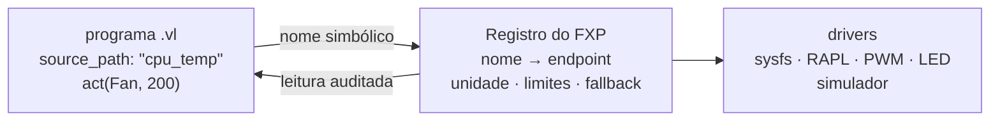

# FXP — sensores e atores

**Neste capítulo:** como o programa fala com o mundo físico sem nunca citar
um caminho de sistema: o registro simbólico do FXP, os dispositivos
obrigatórios, a validação de unidades, o que acontece quando um sensor falha
e como um `act` é aceito, rejeitado ou desviado para um fallback.

## Nomes simbólicos, sempre

O programa declara **intenção** (`source_path: "cpu_temp"`,
`act(CpuPowerCap, 50)`); o **registro do FXP** mapeia nomes para endpoints
concretos — sysfs, ioctl, socket, driver simulado. Consequências:

- caminhos de sistema (`/sys/...`, `/dev/...`) **não** são válidos como
  `source_path`;
- o registro aceita **aliases** (`attention` → `human_attention`) com um nome
  canônico por dispositivo; o Caderno registra o nome usado pela regra e o
  canônico;
- a mesma linguagem roda no laptop com RAPL real e no CI com o simulador —
  o programa não muda.



## O registro mínimo obrigatório

A especificação ([FORMAL §6](../../../docs/FORMAL.md)) fixa o denominador
comum que **toda** implementação do FXP precisa ter:

**Sensores**

| Nome | Grandeza | Unidade | Faixa | Precisão |
|---|---|---|---|---|
| `cpu_temp` | temperatura do processador | °C | 0–120 | ±2% |
| `cpu_power` | potência instantânea da CPU | W | 0–500 | ±5% |
| `attention` | atenção humana | % | 0–100 | backend simulado obrigatório como fallback em CI |

**Atores**

| Nome | Função | min | max | `safety_limit` |
|---|---|---|---|---|
| `CpuPowerCap` | limite de potência da CPU (W) | 10 | 250 | 200 |
| `Fan` | velocidade de ventoinha (PWM) | 0 | 255 | 200 |
| `StatusLed` | estado textual (ex.: `"green"`) | — | — | — |

Fora isso, sensores e atores são extensões registradas (`solar_panel`,
`disk_bytes`, ...) — e não entram na métrica de cobertura de dispositivos do
projeto. O comando `vbl fxp-probe` audita o registro do host atual contra
essa tabela.

## Unidades são contrato

O threshold com unidade (`85°C`, `400W`, `30%`) é convertido para número
puro antes da comparação — mas a **grandeza é validada** contra o registro:
o sensor declara sua unidade e faixa, e a comparação coerente é verificada
em runtime. Unidades de tempo (`s`, `ms`, `us`, `ns`) só existem em
`horizon`, `maintenance_deadline` e `every`. Não há operadores aritméticos
na linguagem — não há como misturar unidades por descuido.

## Falha de sensor: nunca zero

A regra mais importante de I/O da linguagem
([FORMAL §4.7](../../../docs/FORMAL.md)):

> Um sensor ausente **nunca** é tratado como leitura `0.0`. Zero é leitura
> física válida — tratá-lo como zero dispararia condições falsas. Sensor
> não registrado ou inacessível ⇒ **condição não avaliada** naquele tick +
> alerta no Caderno.

O mesmo vale no sentido inverso: dado sintético só circula em modo
**simulado ou híbrido explícito**, sempre marcado no Caderno
(`measurement_status`) — jamais apresentado como leitura real. Em modo real,
dispositivo inacessível é condição não avaliada com alerta; drivers de
fallback atuam na **rota de I/O** (endpoint alternativo), nunca falsificam
leitura.

O registro é validado **em compilação**: referenciar um sensor fora dele é
erro antes de qualquer execução. O exemplo
[`examples/example6_missing_sensor.vl`](../../../examples/example6_missing_sensor.vl)
depende de `solar_panel`, que não está no registro mínimo:

```text
$ vbl check examples/example6_missing_sensor.vl
0:0 [erro] sensor_nao_registrado: source_path 'solar_panel' fora do registro do FXP
0:0 [erro] sensor_nao_registrado: review VigiaSolar regra#0:
           sensor 'solar_panel' fora do registro

$ vbl run examples/example6_missing_sensor.vl \
      --allow-unregistered --ticks 3 --ledger tmp-logs/solar.vcad
■ 3 tick(s) — formas ativas restantes: VigiaSolar (nonequilibrium)
  cadeia SHA-256 ÍNTEGRA: 11 evento(s); atuações 0/0 ok;
  divergências (alertas): 6
```

Com `--allow-unregistered`, o programa roda — e o Caderno acumula um
ALERT por referência por tick: a condição **não é avaliada**, a forma não
colapsa por leitura falsa. A forma sobreviveu aos 3 ticks exatamente porque
*nada* foi avaliado.

## `act`: aceito, rejeitado ou com fallback

Ao enviar `act(Ator, valor)`, o runtime:

1. verifica que o ator está **registrado e disponível**;
2. valida o valor contra os **limites inclusivos** do registro — `min`,
   `max` e `safety_limit`; fora deles, o comando é **rejeitado sem envio**
   e o Caderno registra `actor_rejected_value` (o valor pedido e o limite
   violado). A forma **não** é dissolvida pela rejeição;
3. envia o comando **assíncrono** e registra comando, valor, timestamp e
   custo energético da atuação;
4. se o ator falhar (heartbeat), aplica a **política de fallback do
   registro** (`primary` → alternativos): tentativa, falha e fallback
   executado viram eventos. O runtime não inventa fallback próprio — mas
   pode reagir ao resultado em outra regra.

> [!TIP]
> Simule os três caminhos sem hardware:
> `--register-actor ReserveFan` cria um ator extra;
> `--fail-actor Fan --fallback Fan=ReserveFan` derruba o primário e observa
> o fallback; e `act(Fan, 300)` — acima do máximo 255 — mostra a rejeição
> registrada.

## Os três modos do barramento

| Modo | Leitura | Atuação | Para quê |
|---|---|---|---|
| `simulado` (padrão) | sintética, marcada | simulada | CI, estudo, determinismo |
| `real` | dispositivos do host | dispositivos do host | laboratório, produção |
| `hibrido` | reais onde existem, simuladas onde faltam (marcadas) | idem | desenvolvimento com hardware parcial |

A configuração é do registro (`--fxp-config ARQUIVO` — schema completo em
[FXP-SCHEMA-v1](../../../docs/FXP-SCHEMA-v1.md)); `--fxp-mode` sobrepõe na
linha de comando.

## Próximo passo

[O Caderno](notebook.md): onde cada leitura, atuação e Joule vira evento
encadeado por SHA-256 — e como verificar tudo de fora.
