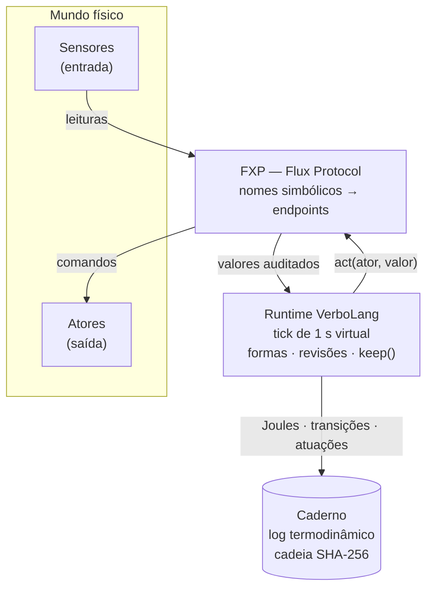

# O que é a VerboLang

**Neste capítulo:** a ideia central da linguagem, o vocabulário mínimo
(forma, conjugação, horizonte, tick, Caderno, FXP) e a anatomia de um
programa `.vl`. Ao final, você lera qualquer exemplo do repositório sem
estranheza — e saberá por que a integridade aqui se mede em Joules.

## Nenhum dado é inerte

Na maioria das linguagens, um dado é uma coisa morta: um `int` senta na
memória até alguém decidir usá-lo, e ninguém pergunta o que ele **custa**
para existir. A VerboLang parte do contrário — o **Materialismo
Computacional**:

- toda estrutura lógica é uma **forma** (*forma*, no sentido de algo que se
  mantém contra a entropia);
- toda forma tem **suporte físico concreto** — bytes na RAM, setores em disco,
  ciclos de CPU — e esse suporte **custa energia**;
- logo, toda forma tem **horizonte de validade**: nada persiste sem esforço,
  e nada é gratuito.

A consequência prática é um contrato honesto: a linguagem não esconde o custo
físico atrás de abstrações "gratuitas". Ela o torna **sintaxe**.

## O vocabulário mínimo

| Termo | O que é |
|---|---|
| **Forma** | A unidade do programa. Tem um `value` (conteúdo lógico) e um `horizon` (prazo de validade), obrigatórios. |
| **Conjugação** | O modo de existir da forma: `event` (transiente), `equilibrium` (sustentado), `nonequilibrium` (laborativo). |
| **Tick** | O batimento do runtime: 1 segundo virtual por padrão. A cada tick, sensores são lidos, regras avaliadas, prazos conferidos, ações executadas. |
| **Review** | As regras de reação de uma forma: `when condição -> ações`. É o único "fluxo de controle" da linguagem. |
| **FXP** | O Flux Protocol: o barramento de I/O. Sensores (entrada) e atores (saída) são referenciados por **nome simbólico** — nunca por caminho de sistema. |
| **Caderno** | O log termodinâmico: cada leitura, atuação, transição e Joule dissipado, encadeado por SHA-256. Auditável por um agente externo. |
| **Alívio Termodinâmico** | O fim natural de uma forma: horizonte esgotado, manutenção vencida, `dissolve` ou `subvert`. Dissolver não é exceção — é o ciclo. |



## A anatomia de um programa

Um programa `.vl` tem três peças: **formas**, **reviews** e, opcionalmente, um
bloco `main`. Este é o exemplo canônico do repositório
([`examples/example1_free_thinking.vl`](../../../examples/example1_free_thinking.vl)):

```verbolang
nonequilibrium FreeThinking {
    value: "consciencia_antineoliberal_ativa",
    horizon: 60s,
    source_path: "attention",
    maintenance_deadline: 3s,
    exchange_mode: "cooperation"
}

review FreeThinking {
    when attention < 30% -> reclassify_as_equilibrium
}
```

Lendo linha a linha:

1. `nonequilibrium FreeThinking { ... }` — declara uma forma **laborativa**:
   trabalho ativo contra a entropia. O nome é um identificador (sem acento
   nem ç).
2. `value: "..."` — o **conteúdo lógico** da forma. É opaco ao runtime: o
   motor nunca interpreta o valor, apenas o carrega, o audita e — em uma
   subversão — o substitui.
3. `horizon: 60s` — o prazo de validade **absoluto**, contado da criação. Em
   60 segundos virtuais, a forma se dissolve por Alívio Termodinâmico, não
   importa o que aconteça.
4. `source_path: "attention"` — de qual **sensor** essa forma depende. O
   nome é simbólico: quem decide qual dispositivo físico (ou simulado)
   responde por `attention` é o registro do FXP.
5. `maintenance_deadline: 3s` — trabalho laborativo exige **manutenção**. Se
   ninguém renovar o suporte por 3 s, a forma **colapsa**.
6. A `review` — a regra: se a atenção humana cair abaixo de 30%, a forma é
   **reclassificada** como `equilibrium`: deixa de exigir manutenção e passa
   a viver em suporte não volátil (um custo em bytes, registrado).

Nenhum `if`, nenhum `while`, nenhuma variável. O tempo é o runtime; a
reação é declarativa; o mundo físico entra pelos sensores e sai pelos atores.

> [!TIP]
> O cheat sheet completo — a linguagem em uma página — está na seção
> [Referência](../../../docs/cheatsheet/VBL-CHEATSHEET.md). É o mesmo
> documento que os agentes LLM do projeto recebem no prompt.

## Por que Joules?

Cada tick, o runtime mede a potência do host (sensor `cpu_power`) e reparte o
consumo entre as formas ativas: cada uma registra `P/N × duração` no Caderno,
convertido para a **moeda** da sua conjugação — ciclos de CPU, bytes ou
watts. Três leituras disso:

- **Custo é primeira classe.** Uma forma que "persiste para sempre" está
  mentindo: ela consome bytes em disco, e a linguagem pede o número
  (`cost_bytes`).
- **Trabalho sem vigilância colapsa.** Um `nonequilibrium` sem `keep()` e sem
  revisão ativa morre no primeiro vencimento — como qualquer processo real
  sem manutenção.
- **Auditoria forte.** O Caderno encadeia cada evento por SHA-256; o
  verificador `vbl ledger-verify` prova, de fora, que o log não foi
  adulterado.

A filosofia completa — as seis leis do Materialismo Computacional — está no
[manifesto](../../../docs/MANIFESTO.md); a semântica exata, na
[especificação formal](../../../docs/FORMAL.md).

## Próximo passo

[Instalação e primeiro run](instalacao.md): compilar o interpretador `vbl`,
rodar a subversão térmica e verificar a cadeia SHA-256 do Caderno — em menos
de cinco minutos.
